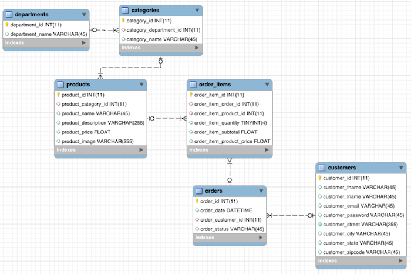
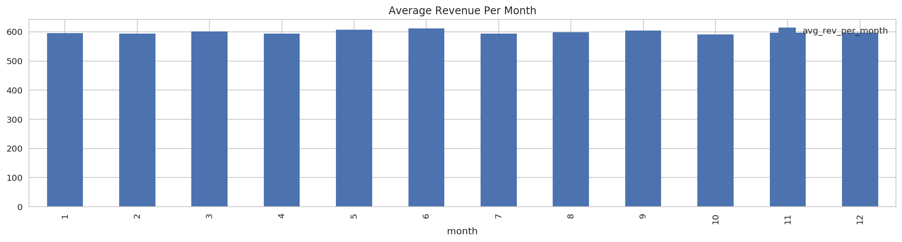
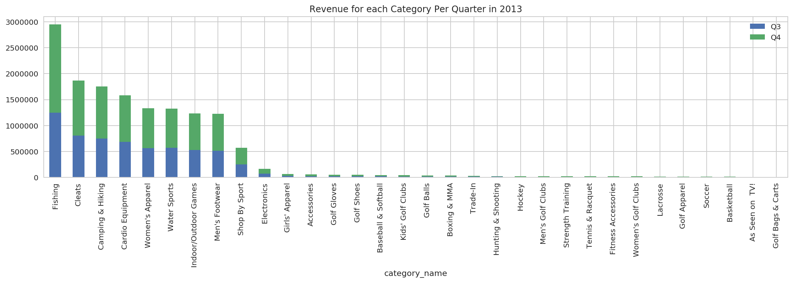
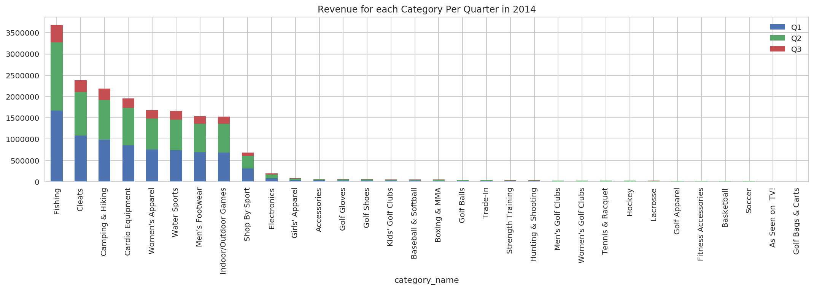
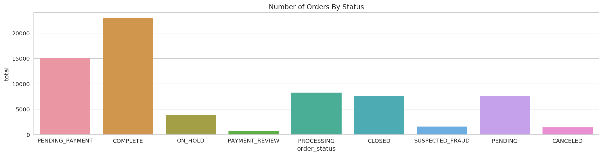

# Advanced Data Analysis of a Retail Store using Apache Spark (PySpark)

In this notebook we will go through Spark SQL as well as Spark DF API based transformations and actions ranging from simple to quite complex. I use this as a reference in my day to day job. These tables come from the Cloudera Installation. A fictitious retail house with the following tables: customers, departments, categories, products, orders and order_items. 

```
@author: Anindya Saha
```
```
@email: mail.anindya@gmail.com
```

## Table of contents

A brief synopsis of what each use case is and what functionality of the SPARK SQL or DF API does it touch on.

| Section                                                                             |        Demonstrates |
|:------------------------------------------------------------------------------------|:--------------------|
|[1. Understanding the Data Set](#1.-Understanding-the-Data-Set:)||
|[2. Creating the Spark Session](#2.-Creating-the-Spark-Session:)||
|[3. Load the Data From Files Into DataFrames](#3.-Load-the-Data-From-Files-Into-DataFrames:)||
|[4.1 Get How many Orders were placed](#4.1-Get-How-many-Orders-were-placed:)|COUNT|
|[4.2 Get Average Revenue Per Order](#4.2-Get-Average-Revenue-Per-Order:)|COUNT, JOIN|
|[4.3 Get Average Revenue Per Day](#4.1-Get-How-many-Orders-were-placed:)|SUM, COUNT, JOIN, GROUP BY, AGG, ORDER BY|
|[4.3.1 Get Average Revenue Per Month](#4.3.1-Get-Average-Revenue-Per-Month:)|MONTH, AVG, JOIN, GROUP BY, ORDER BY|
|[4.3.2 Get Total Revenue Per Month Per Year](#4.3.2-Get-Total-Revenue-Per-Month-Per-Year:)|MONTH, AVG, JOIN, GROUP BY, ORDER BY|
|[4.4 Group Revenues per Month per Year](#4.4-Group-Revenues-per-Month-per-Year:)|GROUPING SETS, ROLLUP, CUBE|
|[4.5 Top Performing Departments](#4.5-Top-Performing-Departments:)|MULTI TABLE JOINS, GROUP BY, ORDER BY|
|[4.6 Get Highest Priced Product](#4.6-Get-Highest-Priced-Product:)|SCALER SUB QUERY, WINDOW, RANK|
|[4.7 Get Highest Revenue Earning Products](#4.7-Get-Highest-Revenue-Earning-Products:)|UNCORRELATED SUB QUERY|
|[4.8 Top 5 Highest Revenue Earning Products Per Month Per Year](#4.8-Top-5-Highest-Revenue-Earning-Products-Per-Month-Per-Year:)|INNER SUB QUERY, WINDOW, DENSE RANK, UDF|
|[4.9 Get the most popular Categories](#4.9-Get-the-most-popular-Categories:)|ORDER BY, LIMIT|
|[4.10 Get the revenue for each Category Per Year Per Quarter](#4.10-Get-the-revenue-for-each-Category-Per-Year-Per-Quarter:)|PIVOT, COALESCE, INNER QUERY|
|[4.11 Get Number of Orders By Status](#4.11-Get-Number-of-Orders-By-Status:)|COUNT|
|[4.12 Get Number of Orders By Order Date and Order Status](#4.12-Get-Number-of-Orders-By-Order-Date-and-Order-Status:)|COUNT, GROUP BY|
|[4.13 Get all CANCELED orders with amount greater than \$1000](#4.13-Get-all-CANCELED-orders-with-amount-greater-than-\$1000:)|FILTER, SUM, AGG, GROUP BY|
|[4.14 Sort Products by Category and Price](#4.14-Sort-Products-by-Category-and-Price:)|ORDER BY|
|[4.15 Sort Products by Price within Each Category](#4.15-Sort-Products-by-Price-within-Each-Category:)|DISTRIBUTE BY, SORT WITHIN PARTITIONS|
|[4.16 Get the topmost 5 products overall sorted by Price Highest to Lowest](#4.16-Get-the-topmost-5-products-overall-sorted-by-Price-Highest-to-Lowest:)|ORDER BY, LIMIT|
|[4.17 Get the topmost 5 products in each category where the products are sorted by Price Highest to Lowest](#4.17-Get-the-topmost-5-products-in-each-category-where-the-products-are-sorted-by-Price-Highest-to-Lowest:)|WINDOW, ROW_NUMBER|
|[4.18 Get topN products by price in each category](#4.18-Get-topN-products-by-price-in-each-category:)|WINDOW, RANK|
|[4.19 Get 'topN priced' products in each category](#4.19-Get-'topN-priced'-products-in-each-category:)|WINDOW, DENSE_RANK|
|[4.20 Get the Customer Id with max revenue on Daily basis](#4.20-Get-the-Customer-Id-with-max-revenue-on-Daily-basis:)|WINDOW, RANK, JOIN|
|[4.21 Get the top 3 Max Revenue Generating Customers Per Month in 2013](#4.21-Get-the-top-3-Max-Revenue-Generating-Customers-Per-Month-in-2013:)|WINDOW, DENSE_RANK, JOIN, SUBQUERY, UDF|
|[4.22 Get All Distinct Pair of Products the occurred in Orders where order total was greater than 300](#4.22-Get-All-Distinct-Pair-of-Products-the-occurred-in-Orders-where-order-total-was-greater-than-300:)|SELF JOIN|
|[4.23 Get All Customers who didn't place an order in August 2013](#4.23-Get-All-Customers-who-didn't-place-an-order-in-August-2013:)|LEFT ANTI JOIN|
|[4.24 Get All Customers who placed more than 5 orders in August 2013](#4.24-Get-All-Customers-who-placed-more-than-5-orders-in-August-2013:)|HAVING CLAUSE|


```python
import os
import pandas as pd
import numpy as np

from pyspark import SparkConf, SparkContext
from pyspark.sql import SparkSession, SQLContext

from pyspark.sql.types import *
from pyspark.sql.window import Window

import pyspark.sql.functions as F
from pyspark.sql.functions import udf, col
```


```python
# Visualization
import seaborn as sns
import matplotlib.pyplot as plt
```


```python
# Visualization
from IPython.core.interactiveshell import InteractiveShell
InteractiveShell.ast_node_interactivity = "all"

pd.set_option('display.max_columns', 50)
pd.set_option('display.max_colwidth', 50)

sns.set(context='notebook', style='whitegrid', rc={'figure.figsize': (18,4)})
#rcParams['figure.figsize'] = 18,4
```


```python
# this allows plots to appear directly in the notebook
%matplotlib inline
%config InlineBackend.figure_format = 'retina'
```


```python
from matplotlib import rcParams
rcParams['figure.figsize'] = 18,4
```


```python
# setting random seed for notebook reproducability
rnd_seed=23
np.random.seed=rnd_seed
np.random.set_state=rnd_seed
```

## 1. Understanding the Data Set:

Picture Source: https://www.cloudera.com/developers/get-started-with-hadoop-tutorial/exercise-1.html

```bash
mysql> describe customers;
+-------------------+--------------+------+-----+---------+----------------+
| Field             | Type         | Null | Key | Default | Extra          |
+-------------------+--------------+------+-----+---------+----------------+
| customer_id       | int(11)      | NO   | PRI | NULL    | auto_increment |
| customer_fname    | varchar(45)  | NO   |     | NULL    |                |
| customer_lname    | varchar(45)  | NO   |     | NULL    |                |
| customer_email    | varchar(45)  | NO   |     | NULL    |                |
| customer_password | varchar(45)  | NO   |     | NULL    |                |
| customer_street   | varchar(255) | NO   |     | NULL    |                |
| customer_city     | varchar(45)  | NO   |     | NULL    |                |
| customer_state    | varchar(45)  | NO   |     | NULL    |                |
| customer_zipcode  | varchar(45)  | NO   |     | NULL    |                |
+-------------------+--------------+------+-----+---------+----------------+

mysql> describe departments;
+-----------------+-------------+------+-----+---------+----------------+
| Field           | Type        | Null | Key | Default | Extra          |
+-----------------+-------------+------+-----+---------+----------------+
| department_id   | int(11)     | NO   | PRI | NULL    | auto_increment |
| department_name | varchar(45) | NO   |     | NULL    |                |
+-----------------+-------------+------+-----+---------+----------------+

mysql> describe categories;
+------------------------+-------------+------+-----+---------+----------------+
| Field                  | Type        | Null | Key | Default | Extra          |
+------------------------+-------------+------+-----+---------+----------------+
| category_id            | int(11)     | NO   | PRI | NULL    | auto_increment |
| category_department_id | int(11)     | NO   |     | NULL    |                |
| category_name          | varchar(45) | NO   |     | NULL    |                |
+------------------------+-------------+------+-----+---------+----------------+

mysql> describe products;
+---------------------+--------------+------+-----+---------+----------------+
| Field               | Type         | Null | Key | Default | Extra          |
+---------------------+--------------+------+-----+---------+----------------+
| product_id          | int(11)      | NO   | PRI | NULL    | auto_increment |
| product_category_id | int(11)      | NO   |     | NULL    |                |
| product_name        | varchar(45)  | NO   |     | NULL    |                |
| product_description | varchar(255) | NO   |     | NULL    |                |
| product_price       | float        | NO   |     | NULL    |                |
| product_image       | varchar(255) | NO   |     | NULL    |                |
+---------------------+--------------+------+-----+---------+----------------+

mysql> describe orders;
+-------------------+-------------+------+-----+---------+----------------+
| Field             | Type        | Null | Key | Default | Extra          |
+-------------------+-------------+------+-----+---------+----------------+
| order_id          | int(11)     | NO   | PRI | NULL    | auto_increment |
| order_date        | datetime    | NO   |     | NULL    |                |
| order_customer_id | int(11)     | NO   |     | NULL    |                |
| order_status      | varchar(45) | NO   |     | NULL    |                |
+-------------------+-------------+------+-----+---------+----------------+

mysql> describe order_items;
+--------------------------+------------+------+-----+---------+----------------+
| Field                    | Type       | Null | Key | Default | Extra          |
+--------------------------+------------+------+-----+---------+----------------+
| order_item_id            | int(11)    | NO   | PRI | NULL    | auto_increment |
| order_item_order_id      | int(11)    | NO   |     | NULL    |                |
| order_item_product_id    | int(11)    | NO   |     | NULL    |                |
| order_item_quantity      | tinyint(4) | NO   |     | NULL    |                |
| order_item_subtotal      | float      | NO   |     | NULL    |                |
| order_item_product_price | float      | NO   |     | NULL    |                |
+--------------------------+------------+------+-----+---------+----------------+
```

[Back to Top](##Table-of-contents)

## 2. Creating the Spark Session:


```python
# The following must be set in your .bashrc file
#SPARK_HOME="/home/ubuntu/spark-2.4.0-bin-hadoop2.7"
#ANACONDA_HOME="/home/ubuntu/anaconda3/envs/pyspark"
#PYSPARK_PYTHON="$ANACONDA_HOME/bin/python"
#PYSPARK_DRIVER_PYTHON="$ANACONDA_HOME/bin/python"
#PYTHONPATH="$ANACONDA_HOME/bin/python"
#export PATH="$ANACONDA_HOME/bin:$SPARK_HOME/bin:$PATH"
```


```python
spark = (SparkSession
         .builder
         .master("local[*]")
         .appName("retail-database-analysis-python")
         .getOrCreate())
```


```python
spark
```


```html
<div>
    <p><b>SparkContext</b></p>
    <p><b>SparkSession - in-memory</b></p>
    <p><a href="http://ip-172-30-2-158.ec2.internal:4040">Spark UI</a></p>

    <dl>
      <dt>Version</dt>
        <dd><code>v2.4.0</code></dd>
      <dt>Master</dt>
        <dd><code>local[*]</code></dd>
      <dt>AppName</dt>
        <dd><code>retail-database-analysis-python</code></dd>
    </dl>
</div>
```


```python
sqlContext = SQLContext(spark.sparkContext)
sqlContext
```


    <pyspark.sql.context.SQLContext at 0x7fae65c09588>


[Back to Top](#Table-of-contents)

## 3. Load the Data From Files Into DataFrames:


```python
CUSTOMERS_DATA =   'data/customers.csv'
DEPARTMENTS_DATA = 'data/departments.csv'
CATEGORIES_DATA =  'data/categories.csv'
PRODUCTS_DATA =    'data/products.csv'
ORDERS_DATA =      'data/orders.csv'
ORDER_ITEMS_DATA = 'data/order_items.csv'
```


```python
# define the schema, corresponding to a line in the csv data file for Customer
customers_schema = StructType([
    StructField('customer_id',       IntegerType(), nullable=True),
    StructField('customer_fname',    StringType(), nullable=True),
    StructField('customer_lname',    StringType(), nullable=True),
    StructField('customer_email',    StringType(), nullable=True),
    StructField('customer_password', StringType(), nullable=True),
    StructField('customer_street',   StringType(), nullable=True),
    StructField('customer_city',     StringType(), nullable=True),
    StructField('customer_state',    StringType(), nullable=True),
    StructField('customer_zipcode',  StringType(), nullable=True)])
```


```python
departments_schema = StructType([
    StructField('department_id',   IntegerType(), nullable=True),
    StructField('department_name', StringType(), nullable=True)])
```


```python
categories_schema = StructType([
    StructField('category_id',            IntegerType(), nullable=True),
    StructField('category_department_id', IntegerType(), nullable=True),
    StructField('category_name',          StringType(), nullable=True)])
```


```python
products_schema = StructType([
    StructField('product_id',          IntegerType(), nullable=True),
    StructField('product_category_id', IntegerType(), nullable=True),
    StructField('product_name',        StringType(), nullable=True),
    StructField('product_description', StringType(), nullable=True),
    StructField('product_price',       FloatType(), nullable=True),
    StructField('product_image',       StringType(), nullable=True)])
```


```python
orders_schema = StructType([
    StructField('order_id',          IntegerType(), nullable=True),
    StructField('order_date',        StringType(), nullable=True),
    StructField('order_customer_id', IntegerType(), nullable=True),
    StructField('order_status',      StringType(), nullable=True)])
```


```python
order_items_schema = StructType([
    StructField('order_item_id',            IntegerType(), nullable=True),
    StructField('order_item_order_id',      IntegerType(), nullable=True),
    StructField('order_item_product_id',    IntegerType(), nullable=True),
    StructField('order_item_quantity',      IntegerType(), nullable=True),
    StructField('order_item_subtotal',      FloatType(), nullable=True),
    StructField('order_item_product_price', FloatType(), nullable=True)])
```


```python
# Load data
customers_df = spark.read.csv(path=CUSTOMERS_DATA, schema=customers_schema)
customers_df.cache()

departments_df = spark.read.csv(path=DEPARTMENTS_DATA, schema=departments_schema)
departments_df.cache()

categories_df = spark.read.csv(path=CATEGORIES_DATA, schema=categories_schema)
categories_df.cache()

products_df = spark.read.csv(path=PRODUCTS_DATA, schema=products_schema)
products_df.cache()

orders_df = spark.read.csv(path=ORDERS_DATA, schema=orders_schema)
orders_df.cache()

order_items_df = spark.read.csv(path=ORDER_ITEMS_DATA, schema=order_items_schema)
order_items_df.cache()
```


[Back to Top](#Table-of-contents)

### 3.1. Register all the DataFrames as Temporary Views:
We cache all the dataframes because we would be using them again and again in different use cases below.


```python
customers_df.createOrReplaceTempView("customers")
```


```python
customers_df.select([col(choice) for choice in np.random.choice(customers_df.columns, size=5, replace=False)]).show(5)
```

    +--------------------+--------------+-----------+--------------+----------------+
    |     customer_street|customer_state|customer_id|customer_fname|customer_zipcode|
    +--------------------+--------------+-----------+--------------+----------------+
    |  6303 Heather Plaza|            TX|          1|       Richard|           78521|
    |9526 Noble Embers...|            CO|          2|          Mary|           80126|
    |3422 Blue Pioneer...|            PR|          3|           Ann|           00725|
    |  8324 Little Common|            CA|          4|          Mary|           92069|
    |10 Crystal River ...|            PR|          5|        Robert|           00725|
    +--------------------+--------------+-----------+--------------+----------------+
    only showing top 5 rows


​    


```python
departments_df.createOrReplaceTempView("departments")
```


```python
departments_df.show(5)
```

    +-------------+---------------+
    |department_id|department_name|
    +-------------+---------------+
    |            2|        Fitness|
    |            3|       Footwear|
    |            4|        Apparel|
    |            5|           Golf|
    |            6|       Outdoors|
    +-------------+---------------+
    only showing top 5 rows


​    


```python
categories_df.createOrReplaceTempView("categories")
```


```python
categories_df.show(5)
```

    +-----------+----------------------+-------------------+
    |category_id|category_department_id|      category_name|
    +-----------+----------------------+-------------------+
    |          1|                     2|           Football|
    |          2|                     2|             Soccer|
    |          3|                     2|Baseball & Softball|
    |          4|                     2|         Basketball|
    |          5|                     2|           Lacrosse|
    +-----------+----------------------+-------------------+
    only showing top 5 rows


​    


```python
products_df.createOrReplaceTempView("products")
```


```python
products_df.show(5)
```

    +----------+-------------------+--------------------+-------------------+-------------+--------------------+
    |product_id|product_category_id|        product_name|product_description|product_price|       product_image|
    +----------+-------------------+--------------------+-------------------+-------------+--------------------+
    |         1|                  2|Quest Q64 10 FT. ...|               null|        59.98|http://images.acm...|
    |         2|                  2|Under Armour Men'...|               null|       129.99|http://images.acm...|
    |         3|                  2|Under Armour Men'...|               null|        89.99|http://images.acm...|
    |         4|                  2|Under Armour Men'...|               null|        89.99|http://images.acm...|
    |         5|                  2|Riddell Youth Rev...|               null|       199.99|http://images.acm...|
    +----------+-------------------+--------------------+-------------------+-------------+--------------------+
    only showing top 5 rows


​    


```python
orders_df.createOrReplaceTempView("orders")
```


```python
orders_df.show(5)
```

    +--------+--------------------+-----------------+---------------+
    |order_id|          order_date|order_customer_id|   order_status|
    +--------+--------------------+-----------------+---------------+
    |       1|2013-07-25 00:00:...|            11599|         CLOSED|
    |       2|2013-07-25 00:00:...|              256|PENDING_PAYMENT|
    |       3|2013-07-25 00:00:...|            12111|       COMPLETE|
    |       4|2013-07-25 00:00:...|             8827|         CLOSED|
    |       5|2013-07-25 00:00:...|            11318|       COMPLETE|
    +--------+--------------------+-----------------+---------------+
    only showing top 5 rows


​    


```python
order_items_df.createOrReplaceTempView("order_items")
```


```python
order_items_df.show(5)
```

    +-------------+-------------------+---------------------+-------------------+-------------------+------------------------+
    |order_item_id|order_item_order_id|order_item_product_id|order_item_quantity|order_item_subtotal|order_item_product_price|
    +-------------+-------------------+---------------------+-------------------+-------------------+------------------------+
    |            1|                  1|                  957|                  1|             299.98|                  299.98|
    |            2|                  2|                 1073|                  1|             199.99|                  199.99|
    |            3|                  2|                  502|                  5|              250.0|                    50.0|
    |            4|                  2|                  403|                  1|             129.99|                  129.99|
    |            5|                  4|                  897|                  2|              49.98|                   24.99|
    +-------------+-------------------+---------------------+-------------------+-------------------+------------------------+
    only showing top 5 rows


​    

[Back to Top](#Table-of-contents)

## 4. Data Analysis:


```python
import re

def strip_margin(text):
    nomargin = re.sub('\n[ \t]*\|', ' ', text)
    trimmed = re.sub('\s+', ' ', nomargin)
    return trimmed
```

### 4.1 Get How many Orders were placed:

**SQL:**


```python
spark.sql("select count(order_id) from orders").show()
```

    +---------------+
    |count(order_id)|
    +---------------+
    |          68883|
    +---------------+


​    

**DF API:**


```python
orders_df.count()
```


    68883


[Back to Top](#Table-of-contents)

### 4.2 Get Average Revenue Per Order:

**SQL:**


```python
# Some orders are cancelled and they do not have corresponding entries in order_items, 
# so we need count(distinct oi.order_item_order_id)
spark.sql(strip_margin(
        """SELECT SUM(oi.order_item_subtotal) / COUNT(DISTINCT oi.order_item_order_id) as avg_rev_per_order
          |FROM orders o JOIN order_items oi 
          |ON o.order_id = oi.order_item_order_id
        """)).show()
```

    +-----------------+
    |avg_rev_per_order|
    +-----------------+
    |597.6322996016944|
    +-----------------+


​    

**DF API:**


```python
# how best to join two DataFrames without having a duplicated colum? Mention them as expression
(orders_df.join(order_items_df, orders_df.order_id == order_items_df.order_item_order_id)
 .select(['order_item_subtotal', 'order_item_order_id'])
 .select((F.sum('order_item_subtotal') / F.countDistinct('order_item_order_id')).alias('avg_rev_per_order'))
 .show())
```

    +-----------------+
    |avg_rev_per_order|
    +-----------------+
    |597.6322996016944|
    +-----------------+


​    

### 4.3 Get Average Revenue Per Day:

**SQL:**


```python
# Some orders are cancelled and they do not have corresponding entries in order_items, 
# so we need count(distinct oi.order_item_order_id)
spark.sql(strip_margin(
        """SELECT o.order_date, sum(oi.order_item_subtotal) / COUNT(DISTINCT oi.order_item_order_id) as avg_rev_per_day
          |FROM orders o JOIN order_items oi 
          |    ON o.order_id = oi.order_item_order_id
          |GROUP BY o.order_date 
          |ORDER BY o.order_date
        """)).show(truncate=False)
```

    +---------------------+-----------------+
    |order_date           |avg_rev_per_day  |
    +---------------------+-----------------+
    |2013-07-25 00:00:00.0|587.5330286848134|
    |2013-07-26 00:00:00.0|585.9234878147109|
    |2013-07-27 00:00:00.0|577.5676682063512|
    |2013-07-28 00:00:00.0|551.4119109020958|
    |2013-07-29 00:00:00.0|635.5883909684641|
    |2013-07-30 00:00:00.0|564.5363838698838|
    |2013-07-31 00:00:00.0|630.9955146643533|
    |2013-08-01 00:00:00.0|608.4982189502356|
    |2013-08-02 00:00:00.0|587.8871075517388|
    |2013-08-03 00:00:00.0|599.1628419048382|
    |2013-08-04 00:00:00.0|594.3201416863335|
    |2013-08-05 00:00:00.0|592.8305590897799|
    |2013-08-06 00:00:00.0|579.68106844792  |
    |2013-08-07 00:00:00.0|583.906170096101 |
    |2013-08-08 00:00:00.0|588.4743191939134|
    |2013-08-09 00:00:00.0|629.4593056380147|
    |2013-08-10 00:00:00.0|586.3113241756664|
    |2013-08-11 00:00:00.0|551.5472206441007|
    |2013-08-12 00:00:00.0|612.4790563343757|
    |2013-08-13 00:00:00.0|604.1594044945457|
    +---------------------+-----------------+
    only showing top 20 rows


​    

**DF API:**


```python
avg_rev_per_day = (orders_df.join(order_items_df, orders_df.order_id == order_items_df.order_item_order_id)
     .select(['order_date', 'order_item_subtotal', 'order_item_order_id'])
     .groupBy('order_date')
     .agg((F.sum('order_item_subtotal') / F.countDistinct('order_item_order_id')).alias('avg_rev_per_day'))
     .orderBy('order_date'))

avg_rev_per_day.cache()
```


    DataFrame[order_date: string, avg_rev_per_day: double]


```python
avg_rev_per_day.show(truncate=False)
```

    +---------------------+-----------------+
    |order_date           |avg_rev_per_day  |
    +---------------------+-----------------+
    |2013-07-25 00:00:00.0|587.5330286848134|
    |2013-07-26 00:00:00.0|585.9234878147109|
    |2013-07-27 00:00:00.0|577.5676682063512|
    |2013-07-28 00:00:00.0|551.4119109020958|
    |2013-07-29 00:00:00.0|635.5883909684641|
    |2013-07-30 00:00:00.0|564.5363838698838|
    |2013-07-31 00:00:00.0|630.9955146643533|
    |2013-08-01 00:00:00.0|608.4982189502356|
    |2013-08-02 00:00:00.0|587.8871075517388|
    |2013-08-03 00:00:00.0|599.1628419048382|
    |2013-08-04 00:00:00.0|594.3201416863335|
    |2013-08-05 00:00:00.0|592.8305590897799|
    |2013-08-06 00:00:00.0|579.68106844792  |
    |2013-08-07 00:00:00.0|583.906170096101 |
    |2013-08-08 00:00:00.0|588.4743191939134|
    |2013-08-09 00:00:00.0|629.4593056380147|
    |2013-08-10 00:00:00.0|586.3113241756664|
    |2013-08-11 00:00:00.0|551.5472206441007|
    |2013-08-12 00:00:00.0|612.4790563343757|
    |2013-08-13 00:00:00.0|604.1594044945457|
    +---------------------+-----------------+
    only showing top 20 rows


​    

### 4.3.1 Get Average Revenue Per Month:

**DF API:**


```python
avg_rev_per_month = (avg_rev_per_day
                     .select(F.month('order_date').alias('month'), 'avg_rev_per_day')
                     .groupBy('month')
                     .agg(F.avg('avg_rev_per_day').alias('avg_rev_per_month'))
                     .orderBy('month'))

avg_rev_per_month.cache()
```


    DataFrame[month: int, avg_rev_per_month: double]


```python
avg_rev_per_month.show(truncate=False)
```

    +-----+-----------------+
    |month|avg_rev_per_month|
    +-----+-----------------+
    |1    |595.4252200140596|
    |2    |594.3819554505748|
    |3    |601.5593062028504|
    |4    |594.360451299625 |
    |5    |606.5245105647007|
    |6    |611.6376611446879|
    |7    |593.4468831474544|
    |8    |597.588355427047 |
    |9    |604.5177239484814|
    |10   |590.8111000351574|
    |11   |597.1851199455583|
    |12   |596.4810251733772|
    +-----+-----------------+


​    


```python
avg_rev_per_month.toPandas().plot.bar(x='month', title='Average Revenue Per Month');
```





```python
avg_rev_per_month.unpersist()
avg_rev_per_day.unpersist()
```


    DataFrame[month: int, avg_rev_per_month: double]


    DataFrame[order_date: string, avg_rev_per_day: double]


### 4.3.2 Get Total Revenue Per Month Per Year:

**SQL:**


```python
spark.sql(strip_margin(
        """SELECT YEAR(o.order_date) as order_year, MONTH(o.order_date) as order_month, SUM(oi.order_item_subtotal) tot_revenue 
          |FROM orders o JOIN order_items oi 
          |    ON o.order_id = oi.order_item_order_id
          |GROUP BY order_year, order_month 
          |ORDER BY order_year, order_month
        """)).show(truncate=False)
```

    +----------+-----------+------------------+
    |order_year|order_month|tot_revenue       |
    +----------+-----------+------------------+
    |2013      |7          |764782.2047252655 |
    |2013      |8          |2828658.754573822 |
    |2013      |9          |2934527.3265972137|
    |2013      |10         |2624600.6605644226|
    |2013      |11         |3168656.0921707153|
    |2013      |12         |2932964.327445984 |
    |2014      |1          |2924447.0670757294|
    |2014      |2          |2778663.7149181366|
    |2014      |3          |2862492.265932083 |
    |2014      |4          |2807789.8547916412|
    |2014      |5          |2753078.2738227844|
    |2014      |6          |2703463.491306305 |
    |2014      |7          |2238496.5645008087|
    +----------+-----------+------------------+


​    

**DF API:**


```python
tot_rev_per_month_per_year = (orders_df.join(order_items_df, orders_df.order_id == order_items_df.order_item_order_id)
     .select([F.year('order_date').alias('order_year'), F.month('order_date').alias('order_month'), 'order_item_subtotal'])
     .groupBy(['order_year', 'order_month'])
     .agg(F.sum('order_item_subtotal').alias('tot_revenue'))
     .orderBy(['order_year', 'order_month']))

tot_rev_per_month_per_year.cache()
```


    DataFrame[order_year: int, order_month: int, tot_revenue: double]


```python
tot_rev_per_month_per_year.show()
```

    +----------+-----------+------------------+
    |order_year|order_month|       tot_revenue|
    +----------+-----------+------------------+
    |      2013|          7| 764782.2047252655|
    |      2013|          8| 2828658.754573822|
    |      2013|          9|2934527.3265972137|
    |      2013|         10|2624600.6605644226|
    |      2013|         11|3168656.0921707153|
    |      2013|         12| 2932964.327445984|
    |      2014|          1|2924447.0670757294|
    |      2014|          2|2778663.7149181366|
    |      2014|          3| 2862492.265932083|
    |      2014|          4|2807789.8547916412|
    |      2014|          5|2753078.2738227844|
    |      2014|          6| 2703463.491306305|
    |      2014|          7|2238496.5645008087|
    +----------+-----------+------------------+


​    


```python
pdf = tot_rev_per_month_per_year.toPandas()
```


```python
g = sns.barplot(x='order_month', y='tot_revenue', hue='order_year', data=pdf)
g.set_title('Total Revenue Per Month Per Year');
```


```python
tot_rev_per_month_per_year.unpersist()
```


    DataFrame[order_year: int, order_month: int, tot_revenue: double]


### 4.4 Group Revenues per Month per Year:
The idea is taken from the book [Spark: The Definitive Guide](http://shop.oreilly.com/product/0636920034957.do) We have seen simple group-by expressions that we can use to aggregate on a set of columns with the values in those columns. However, sometimes we want something a bit more complete - an aggregation across multiple groups. We achieve this by using `grouping sets`

**SQL:**

When we want to do traditional sum of revenues per month per year we can achieve the same using `grouping sets` as well besides the traditional `group by` as shown below:


```python
spark.sql(strip_margin(
        """SELECT YEAR(o.order_date) as order_year, MONTH(o.order_date) as order_month, CAST(SUM(oi.order_item_subtotal) AS DECIMAL(38,2)) as tot_revenue 
          |FROM orders o JOIN order_items oi 
          |    ON o.order_id = oi.order_item_order_id
          |GROUP BY order_year, order_month GROUPING SETS((order_year, order_month))
          |ORDER BY order_year, order_month
        """)).show(50)
```

    +----------+-----------+-----------+
    |order_year|order_month|tot_revenue|
    +----------+-----------+-----------+
    |      2013|          7|  764782.20|
    |      2013|          8| 2828658.75|
    |      2013|          9| 2934527.33|
    |      2013|         10| 2624600.66|
    |      2013|         11| 3168656.09|
    |      2013|         12| 2932964.33|
    |      2014|          1| 2924447.07|
    |      2014|          2| 2778663.71|
    |      2014|          3| 2862492.27|
    |      2014|          4| 2807789.85|
    |      2014|          5| 2753078.27|
    |      2014|          6| 2703463.49|
    |      2014|          7| 2238496.56|
    +----------+-----------+-----------+


​    

Simple enough, but what if we also want to include the total revenue irrespective of the `order_month` and the `order_year` in the same result? With a conventional group-by statement, this would be impossible. But it's simple with `grouping sets`: we simply specify that we would like to aggregate at that level, as well in our grouping set. This is, effectively, the union of several different groupings together.


```python
spark.sql(strip_margin(
        """SELECT YEAR(o.order_date) as order_year, MONTH(o.order_date) as order_month, CAST(SUM(oi.order_item_subtotal) AS DECIMAL(38,2)) as tot_revenue 
          |FROM orders o JOIN order_items oi 
          |    ON o.order_id = oi.order_item_order_id
          |GROUP BY order_year, order_month GROUPING SETS((order_year, order_month),())
          |ORDER BY order_year, order_month
        """)).show(50)
```

    +----------+-----------+-----------+
    |order_year|order_month|tot_revenue|
    +----------+-----------+-----------+
    |      null|       null|34322620.60|
    |      2013|          7|  764782.20|
    |      2013|          8| 2828658.75|
    |      2013|          9| 2934527.33|
    |      2013|         10| 2624600.66|
    |      2013|         11| 3168656.09|
    |      2013|         12| 2932964.33|
    |      2014|          1| 2924447.07|
    |      2014|          2| 2778663.71|
    |      2014|          3| 2862492.27|
    |      2014|          4| 2807789.85|
    |      2014|          5| 2753078.27|
    |      2014|          6| 2703463.49|
    |      2014|          7| 2238496.56|
    +----------+-----------+-----------+


​    

Here, include the following groupings in the same result:
- total revenue irrespective of the `order_year` and `order_month`
- total revenue per `order_year`  irrespective of the `order_month`
- total revenue per `order_month` irrespective of the `order_year`
- total revenue per `order_year`  per `order_month`


```python
spark.sql(strip_margin(
        """SELECT YEAR(o.order_date) as order_year, MONTH(o.order_date) as order_month, CAST(SUM(oi.order_item_subtotal) AS DECIMAL(38,2)) as tot_revenue  
          |FROM orders o JOIN order_items oi 
          |    ON o.order_id = oi.order_item_order_id
          |GROUP BY order_year, order_month GROUPING SETS((order_year, order_month), (order_year), (order_month), ())
          |ORDER BY order_year, order_month
        """)).show(50)
```

    +----------+-----------+-----------+
    |order_year|order_month|tot_revenue|
    +----------+-----------+-----------+
    |      null|       null|34322620.60|
    |      null|          1| 2924447.07|
    |      null|          2| 2778663.71|
    |      null|          3| 2862492.27|
    |      null|          4| 2807789.85|
    |      null|          5| 2753078.27|
    |      null|          6| 2703463.49|
    |      null|          7| 3003278.77|
    |      null|          8| 2828658.75|
    |      null|          9| 2934527.33|
    |      null|         10| 2624600.66|
    |      null|         11| 3168656.09|
    |      null|         12| 2932964.33|
    |      2013|       null|15254189.37|
    |      2013|          7|  764782.20|
    |      2013|          8| 2828658.75|
    |      2013|          9| 2934527.33|
    |      2013|         10| 2624600.66|
    |      2013|         11| 3168656.09|
    |      2013|         12| 2932964.33|
    |      2014|       null|19068431.23|
    |      2014|          1| 2924447.07|
    |      2014|          2| 2778663.71|
    |      2014|          3| 2862492.27|
    |      2014|          4| 2807789.85|
    |      2014|          5| 2753078.27|
    |      2014|          6| 2703463.49|
    |      2014|          7| 2238496.56|
    +----------+-----------+-----------+


​    

**DF API:**
The GROUPING SETS operator is only available in SQL. To perform the same in DataFrames, we need to use the `rollup` and `cube` operators - which allow us to get the same results.

Let's first get all the sales.


```python
rev_df = (orders_df.join(order_items_df, orders_df.order_id == order_items_df.order_item_order_id)
     .select([F.year('order_date').alias('order_year'), F.month('order_date').alias('order_month'), 'order_item_subtotal']))

rev_df.cache()
```


    DataFrame[order_year: int, order_month: int, order_item_subtotal: float]


```python
rev_df.show(truncate=False)
```

    +----------+-----------+-------------------+
    |order_year|order_month|order_item_subtotal|
    +----------+-----------+-------------------+
    |2013      |7          |299.98             |
    |2013      |7          |199.99             |
    |2013      |7          |250.0              |
    |2013      |7          |129.99             |
    |2013      |7          |49.98              |
    |2013      |7          |299.95             |
    |2013      |7          |150.0              |
    |2013      |7          |199.92             |
    |2013      |7          |299.98             |
    |2013      |7          |299.95             |
    |2013      |7          |99.96              |
    |2013      |7          |299.98             |
    |2013      |7          |129.99             |
    |2013      |7          |199.99             |
    |2013      |7          |299.98             |
    |2013      |7          |79.95              |
    |2013      |7          |179.97             |
    |2013      |7          |299.95             |
    |2013      |7          |199.92             |
    |2013      |7          |50.0               |
    +----------+-----------+-------------------+
    only showing top 20 rows


​    


```python
pdf = rev_df.toPandas()
```


```python
g = sns.boxplot(x='order_month', y='order_item_subtotal', hue='order_year', data=pdf)
g.set_title('Distribution of Revenue Per Month for 2013');
```


**Rollups:**
A `rollup` is a multidimensional aggregation that performs a variety of group-by style calculation for us. When we do a `rollup` based on `order_year` and `order_month` then we get the following multidimensional aggregations:
- total revenue irrespective of the `order_year` and `order_month`
- total revenue per `order_year`  irrespective of the `order_month`
- total revenue per `order_year`  per `order_month`


```python
(rev_df
 .rollup("order_year", "order_month")
 .agg(F.sum(col("order_item_subtotal")).cast(DecimalType(38, 2)).alias("tot_revenue"))
 .orderBy(['order_year', 'order_month'])).show(50)
```

    +----------+-----------+-----------+
    |order_year|order_month|tot_revenue|
    +----------+-----------+-----------+
    |      null|       null|34322620.60|
    |      2013|       null|15254189.37|
    |      2013|          7|  764782.20|
    |      2013|          8| 2828658.75|
    |      2013|          9| 2934527.33|
    |      2013|         10| 2624600.66|
    |      2013|         11| 3168656.09|
    |      2013|         12| 2932964.33|
    |      2014|       null|19068431.23|
    |      2014|          1| 2924447.07|
    |      2014|          2| 2778663.71|
    |      2014|          3| 2862492.27|
    |      2014|          4| 2807789.85|
    |      2014|          5| 2753078.27|
    |      2014|          6| 2703463.49|
    |      2014|          7| 2238496.56|
    +----------+-----------+-----------+


​    

**Cube:**
In `rollup` above we did not get the aggregation
- total revenue per `order_month` irrespective of the `order_year`

Rollup treats elements hierarchically and since `order_month` was the last element in the group-by clause so it is treated as the last level of hierarchy and hence to grouping was performed on `order_month` alone. We can use `cube` here. A `cube` takes the `rollup` to a level deeper. Rather than treating elements hierarchically, a cube does the same thing across all dimensions. This means it won't just go by `order_year` over the entire time period, but also the `order_month`. 

Using `cube` helps to answer all the of the following in one aggregate DataFrame.
- total revenue irrespective of the `order_year` and `order_month`
- total revenue per `order_year`  irrespective of the `order_month`
- total revenue per `order_month` irrespective of the `order_year`
- total revenue per `order_year`  per `order_month`


```python
(rev_df
 .cube("order_year", "order_month")
 .agg(F.sum(col("order_item_subtotal")).alias("total_sales"))
 .orderBy(['order_year', 'order_month'])).show(50)
```

    +----------+-----------+--------------------+
    |order_year|order_month|         total_sales|
    +----------+-----------+--------------------+
    |      null|       null| 3.432262059842491E7|
    |      null|          1|  2924447.0670757294|
    |      null|          2|  2778663.7149181366|
    |      null|          3|   2862492.265932083|
    |      null|          4|  2807789.8547916412|
    |      null|          5|  2753078.2738227844|
    |      null|          6|   2703463.491306305|
    |      null|          7|   3003278.769226074|
    |      null|          8|   2828658.754573822|
    |      null|          9|  2934527.3265972137|
    |      null|         10|  2624600.6605644226|
    |      null|         11|  3168656.0921707153|
    |      null|         12|   2932964.327445984|
    |      2013|       null|1.5254189366077423E7|
    |      2013|          7|   764782.2047252655|
    |      2013|          8|   2828658.754573822|
    |      2013|          9|  2934527.3265972137|
    |      2013|         10|  2624600.6605644226|
    |      2013|         11|  3168656.0921707153|
    |      2013|         12|   2932964.327445984|
    |      2014|       null| 1.906843123234749E7|
    |      2014|          1|  2924447.0670757294|
    |      2014|          2|  2778663.7149181366|
    |      2014|          3|   2862492.265932083|
    |      2014|          4|  2807789.8547916412|
    |      2014|          5|  2753078.2738227844|
    |      2014|          6|   2703463.491306305|
    |      2014|          7|  2238496.5645008087|
    +----------+-----------+--------------------+


​    

[Back to Top](#Table-of-contents)

### 4.5 Top Performing Departments:

**SQL:**


```python
spark.sql(strip_margin(
        """SELECT d.department_name, YEAR(o.order_date) as order_year, SUM(oi.order_item_subtotal) as tot_revenue
          |FROM orders o 
          |    INNER JOIN order_items oi 
          |        ON o.order_id = oi.order_item_order_id
          |    INNER JOIN products p
          |        ON oi.order_item_product_id = p.product_id
          |    INNER JOIN categories c
          |        ON c.category_id = p.product_category_id
          |    INNER JOIN departments d
          |        ON c.category_department_id = d.department_id
          |WHERE o.order_status <> 'CANCELED' AND o.order_status <> 'SUSPECTED_FRAUD'
          |GROUP BY d.department_name, order_year
          |ORDER BY d.department_name, order_year
        """)).show(truncate=False)
```

    +---------------+----------+------------------+
    |department_name|order_year|tot_revenue       |
    +---------------+----------+------------------+
    |Apparel        |2013      |3090985.6535224915|
    |Apparel        |2014      |3917585.841217041 |
    |Fan Shop       |2013      |7290831.879999161 |
    |Fan Shop       |2014      |9095735.77280426  |
    |Fitness        |2013      |119526.58082199097|
    |Fitness        |2014      |150509.1409931183 |
    |Footwear       |2013      |1711492.5186824799|
    |Footwear       |2014      |2122339.649032593 |
    |Golf           |2013      |1967396.959728241 |
    |Golf           |2014      |2440585.2815055847|
    |Outdoors       |2013      |420317.9507675171 |
    |Outdoors       |2014      |532437.6709976196 |
    +---------------+----------+------------------+


​    

**DF API:**


```python
df = (orders_df
      .filter((orders_df.order_status != 'CANCELED') & (orders_df.order_status != 'SUSPECTED_FRAUD'))
      .join(order_items_df, orders_df.order_id == order_items_df.order_item_order_id, how='inner')
      .join(products_df, order_items_df.order_item_product_id == products_df.product_id, how='inner')
      .join(categories_df, products_df.product_category_id == categories_df.category_id, how='inner')
      .join(departments_df, categories_df.category_department_id == departments_df.department_id, how='inner')
      .select('department_name', F.year(orders_df.order_date).alias('order_year'), 'order_item_subtotal')
      .groupBy([departments_df.department_name, 'order_year'])
      .agg(F.sum(order_items_df.order_item_subtotal).alias('tot_revenue'))
      .orderBy('department_name', 'order_year'))
df.cache()
```


    DataFrame[department_name: string, order_year: int, tot_revenue: double]


```python
df.show()
```

    +---------------+----------+------------------+
    |department_name|order_year|       tot_revenue|
    +---------------+----------+------------------+
    |        Apparel|      2013|3090985.6535224915|
    |        Apparel|      2014| 3917585.841217041|
    |       Fan Shop|      2013| 7290831.879999161|
    |       Fan Shop|      2014|  9095735.77280426|
    |        Fitness|      2013|119526.58082199097|
    |        Fitness|      2014| 150509.1409931183|
    |       Footwear|      2013|1711492.5186824799|
    |       Footwear|      2014| 2122339.649032593|
    |           Golf|      2013| 1967396.959728241|
    |           Golf|      2014|2440585.2815055847|
    |       Outdoors|      2013| 420317.9507675171|
    |       Outdoors|      2014| 532437.6709976196|
    +---------------+----------+------------------+


​    


```python
pdf = df.toPandas()
```


```python
pdf = pdf.pivot(index='department_name', columns='order_year', values='tot_revenue')
```


```python
print(pdf)
```

    order_year               2013          2014
    department_name                            
    Apparel          3.090986e+06  3.917586e+06
    Fan Shop         7.290832e+06  9.095736e+06
    Fitness          1.195266e+05  1.505091e+05
    Footwear         1.711493e+06  2.122340e+06
    Golf             1.967397e+06  2.440585e+06
    Outdoors         4.203180e+05  5.324377e+05


```python
pdf.plot.bar(stacked=True, title='Top Performing Departments');
```


```python
df.unpersist()
```


    DataFrame[department_name: string, order_year: int, tot_revenue: double]


[Back to Top](#Table-of-contents)

### 4.6 Get Highest Priced Product:

**SQL:**


```python
spark.sql(strip_margin(
        """SELECT p.* 
          |FROM products p
          |WHERE p.product_price = (SELECT MAX(q.product_price) FROM products q)
        """)).show()
```

    +----------+-------------------+-------------------+-------------------+-------------+--------------------+
    |product_id|product_category_id|       product_name|product_description|product_price|       product_image|
    +----------+-------------------+-------------------+-------------------+-------------+--------------------+
    |       208|                 10|SOLE E35 Elliptical|               null|      1999.99|http://images.acm...|
    +----------+-------------------+-------------------+-------------------+-------------+--------------------+


​    

**SQL Using rank() Window Function:**


```python
spark.sql(strip_margin(
        """SELECT * 
          |FROM ( 
          |    SELECT *, 
          |         RANK() OVER (ORDER BY product_price DESC) as rank
          |    FROM products) tmp
          |WHERE rank <= 1
        """)).show()
```

    +----------+-------------------+-------------------+-------------------+-------------+--------------------+----+
    |product_id|product_category_id|       product_name|product_description|product_price|       product_image|rank|
    +----------+-------------------+-------------------+-------------------+-------------+--------------------+----+
    |       208|                 10|SOLE E35 Elliptical|               null|      1999.99|http://images.acm...|   1|
    +----------+-------------------+-------------------+-------------------+-------------+--------------------+----+


​    

**DF API:**


```python
(products_df
 .select('*')
 .filter(col('product_price') == products_df.select(F.max('product_price')).collect()[0][0])
 .show())
```

    +----------+-------------------+-------------------+-------------------+-------------+--------------------+
    |product_id|product_category_id|       product_name|product_description|product_price|       product_image|
    +----------+-------------------+-------------------+-------------------+-------------+--------------------+
    |       208|                 10|SOLE E35 Elliptical|               null|      1999.99|http://images.acm...|
    +----------+-------------------+-------------------+-------------------+-------------+--------------------+


​    

**DF API Using Window Function:**


```python
windowSpec = Window.orderBy(products_df['product_price'].desc())
```


```python
products_df.select('*', F.rank().over(windowSpec).alias('rank')).filter(col('rank') <= 1).show()
```

    +----------+-------------------+-------------------+-------------------+-------------+--------------------+----+
    |product_id|product_category_id|       product_name|product_description|product_price|       product_image|rank|
    +----------+-------------------+-------------------+-------------------+-------------+--------------------+----+
    |       208|                 10|SOLE E35 Elliptical|               null|      1999.99|http://images.acm...|   1|
    +----------+-------------------+-------------------+-------------------+-------------+--------------------+----+


​    

[Back to Top](#Table-of-contents)

### 4.7 Get Highest Revenue Earning Products:

**SQL:**


```python
spark.sql(strip_margin(
        """SELECT p.*, r.product_revenue
          |FROM products p, (SELECT oi.order_item_product_id, SUM(CAST(oi.order_item_subtotal as float)) as product_revenue
          |                    FROM order_items oi 
          |                    GROUP BY order_item_product_id 
          |                    ORDER BY product_revenue DESC 
          |                    LIMIT 1) r
          |WHERE product_id = r.order_item_product_id
        """)).show()
```

    +----------+-------------------+--------------------+-------------------+-------------+--------------------+-----------------+
    |product_id|product_category_id|        product_name|product_description|product_price|       product_image|  product_revenue|
    +----------+-------------------+--------------------+-------------------+-------------+--------------------+-----------------+
    |      1004|                 45|Field & Stream Sp...|               null|       399.98|http://images.acm...|6929653.690338135|
    +----------+-------------------+--------------------+-------------------+-------------+--------------------+-----------------+


​    

**SQL:**


```python
# Top 10 revenue generating products (another way of doing similar thing as above)
spark.sql(strip_margin(
        """SELECT p.product_id, p.product_category_id, p.product_name, r.product_revenue
          |FROM products p INNER JOIN
          |                    (SELECT oi.order_item_product_id, round(SUM(CAST(oi.order_item_subtotal as float)), 2) as product_revenue
          |                     FROM order_items oi INNER JOIN orders o 
          |                         ON oi.order_item_order_id = o.order_id
          |                     WHERE o.order_status <> 'CANCELED'
          |                     AND o.order_status <> 'SUSPECTED_FRAUD'
          |                     GROUP BY oi.order_item_product_id) r
          |ON p.product_id = r.order_item_product_id
          |ORDER BY r.product_revenue DESC
          |LIMIT 10
        """)).show(truncate=False)
```

    +----------+-------------------+---------------------------------------------+---------------+
    |product_id|product_category_id|product_name                                 |product_revenue|
    +----------+-------------------+---------------------------------------------+---------------+
    |1004      |45                 |Field & Stream Sportsman 16 Gun Fire Safe    |6637668.28     |
    |365       |17                 |Perfect Fitness Perfect Rip Deck             |4233794.37     |
    |957       |43                 |Diamondback Women's Serene Classic Comfort Bi|3946837.0      |
    |191       |9                  |Nike Men's Free 5.0+ Running Shoe            |3507549.21     |
    |502       |24                 |Nike Men's Dri-FIT Victory Golf Polo         |3011600.0      |
    |1073      |48                 |Pelican Sunstream 100 Kayak                  |2967851.68     |
    |1014      |46                 |O'Brien Men's Neoprene Life Vest             |2765543.31     |
    |403       |18                 |Nike Men's CJ Elite 2 TD Football Cleat      |2763977.49     |
    |627       |29                 |Under Armour Girls' Toddler Spine Surge Runni|1214896.22     |
    |565       |26                 |adidas Youth Germany Black/Red Away Match Soc|63490.0        |
    +----------+-------------------+---------------------------------------------+---------------+


​    

**DF API:**


```python
# 1. Get the sum of revenue of all the products grouped by order_item_product_id from order_items table
# 2. Sort the result in descending order of their revenues
# 3. Take only the first one from the sorted order using the limit() function
# 4. Join with the prorcuts column to get the product details
(order_items_df.select(['order_item_product_id', 'order_item_subtotal'])
     .groupBy('order_item_product_id')
     .agg(F.sum('order_item_subtotal').alias('product_revenue'))
     .orderBy('product_revenue', ascending=False)
     .limit(1)
     .join(products_df, order_items_df.order_item_product_id == products_df.product_id, how='inner')
     .select('product_id', 'product_category_id', 'product_name', 'product_revenue')
     .show())
```

    +----------+-------------------+--------------------+-----------------+
    |product_id|product_category_id|        product_name|  product_revenue|
    +----------+-------------------+--------------------+-----------------+
    |      1004|                 45|Field & Stream Sp...|6929653.690338135|
    +----------+-------------------+--------------------+-----------------+


​    

[Back to Top](#Table-of-contents)

### 4.8 Top 5 Highest Revenue Earning Products Per Month Per Year:

**SQL:**


```python
# Map from month number to actual month string
monthmap = {1:"Jan", 2:"Feb", 3:"Mar",  4:"Apr", 5:"May", 6:"Jun", 7:"Jul", 8:"Aug", 9:"Sep", 10:"Oct", 11:"Nov", 12:"Dec"}
```


```python
# in order to use an udf with sql it needs to be registerd to sqlContext
sqlContext.udf.register("udfmonTomonth", lambda m: monthmap[m], StringType())
```


    <function __main__.<lambda>>


```python
df = spark.sql(strip_margin(
        """SELECT q.* 
          |FROM (
          |     SELECT r.*, DENSE_RANK() OVER (PARTITION by order_year, order_month ORDER BY product_revenue DESC) as dense_rank
          |     FROM (
          |          SELECT YEAR(o.order_date) as order_year, udfmonTomonth(MONTH(o.order_date)) as order_month, p.product_name, ROUND(SUM(CAST(oi.order_item_subtotal as float)), 2) as product_revenue
          |          FROM order_items oi 
          |              INNER JOIN orders o 
          |                  ON oi.order_item_order_id = o.order_id
          |              INNER JOIN products p
          |                  ON oi.order_item_product_id = p.product_id
          |              WHERE o.order_status <> 'CANCELED' AND o.order_status <> 'SUSPECTED_FRAUD'
          |              GROUP BY order_year, order_month, p.product_name ) r ) q
          |WHERE q.dense_rank <= 5
          |ORDER BY q.order_year, q.order_month, q.dense_rank
        """))

df.cache()
```


    DataFrame[order_year: int, order_month: string, product_name: string, product_revenue: double, dense_rank: int]


```python
df.show(truncate=False)
```

    +----------+-----------+---------------------------------------------+---------------+----------+
    |order_year|order_month|product_name                                 |product_revenue|dense_rank|
    +----------+-----------+---------------------------------------------+---------------+----------+
    |2013      |Aug        |Field & Stream Sportsman 16 Gun Fire Safe    |540772.97      |1         |
    |2013      |Aug        |Perfect Fitness Perfect Rip Deck             |349861.69      |2         |
    |2013      |Aug        |Diamondback Women's Serene Classic Comfort Bi|319778.69      |3         |
    |2013      |Aug        |Nike Men's Free 5.0+ Running Shoe            |279172.08      |4         |
    |2013      |Aug        |Nike Men's Dri-FIT Victory Golf Polo         |247700.0       |5         |
    |2013      |Dec        |Field & Stream Sportsman 16 Gun Fire Safe    |595570.24      |1         |
    |2013      |Dec        |Perfect Fitness Perfect Rip Deck             |342842.86      |2         |
    |2013      |Dec        |Diamondback Women's Serene Classic Comfort Bi|336277.59      |3         |
    |2013      |Dec        |Nike Men's Free 5.0+ Running Shoe            |298370.16      |4         |
    |2013      |Dec        |Pelican Sunstream 100 Kayak                  |249987.51      |5         |
    |2013      |Jul        |Field & Stream Sportsman 16 Gun Fire Safe    |150792.46      |1         |
    |2013      |Jul        |Perfect Fitness Perfect Rip Deck             |98923.51       |2         |
    |2013      |Jul        |Diamondback Women's Serene Classic Comfort Bi|92993.8        |3         |
    |2013      |Jul        |Nike Men's Free 5.0+ Running Shoe            |77192.28       |4         |
    |2013      |Jul        |Nike Men's Dri-FIT Victory Golf Polo         |64750.0        |5         |
    |2013      |Nov        |Field & Stream Sportsman 16 Gun Fire Safe    |605969.72      |1         |
    |2013      |Nov        |Perfect Fitness Perfect Rip Deck             |384655.89      |2         |
    |2013      |Nov        |Diamondback Women's Serene Classic Comfort Bi|375874.95      |3         |
    |2013      |Nov        |Nike Men's Free 5.0+ Running Shoe            |328567.14      |4         |
    |2013      |Nov        |Nike Men's Dri-FIT Victory Golf Polo         |278400.0       |5         |
    +----------+-----------+---------------------------------------------+---------------+----------+
    only showing top 20 rows


​    


```python
pdf = df.toPandas()
```

**For 2013:**


```python
g = sns.barplot(x="order_month", y="product_revenue", hue="product_name", data=pdf[pdf['order_year'] == 2013])
g.set_title('Top 5 Highest Revenue Earning Products Per Month in 2013');
```


**For 2014:**


```python
g = sns.barplot(x="order_month", y="product_revenue", hue="product_name", data=pdf[pdf['order_year'] == 2014]);
g.set_title('Top 5 Highest Revenue Earning Products Per Month in 2014');
```


```python
df.unpersist()
```


    DataFrame[order_year: int, order_month: string, product_name: string, product_revenue: double, dense_rank: int]


**DF API:**


```python
# Define a udf
udfmonTomonth = udf(lambda m: monthmap[m], StringType())
```


```python
rev_per_month_per_year_per_product = (orders_df
                         .select(F.year('order_date').alias('order_year'), udfmonTomonth(F.month('order_date')).alias('order_month'), 'order_id', 'order_status')
                         .where((col('order_status') != 'CANCELED') & (col('order_status') != 'SUSPECTED_FRAUD'))
                         .join(order_items_df, orders_df.order_id == order_items_df.order_item_order_id, how='inner')
                         .join(products_df, order_items_df.order_item_product_id == products_df.product_id, how='inner')
                         .select(['order_year', 'order_month', 'product_name', 'order_item_subtotal'])
                         .groupBy(['order_year', 'order_month', 'product_name'])
                         .agg(F.round(F.sum('order_item_subtotal'), 2).alias('product_revenue')))

rev_per_month_per_year_per_product.cache()
```


    DataFrame[order_year: int, order_month: string, product_name: string, product_revenue: double]


```python
rev_per_month_per_year_per_product.show(5, truncate=False)
```

    +----------+-----------+---------------------------------------------+---------------+
    |order_year|order_month|product_name                                 |product_revenue|
    +----------+-----------+---------------------------------------------+---------------+
    |2013      |Nov        |Under Armour Women's Micro G Skulpt Running S|3792.93        |
    |2013      |Oct        |Polar Loop Activity Tracker                  |329.85         |
    |2014      |Jan        |Bushnell Pro X7 Jolt Slope Rangefinder       |599.99         |
    |2013      |Aug        |Hirzl Men's Hybrid Golf Glove                |1064.29        |
    |2014      |Feb        |Titleist Small Wheeled Travel Cover          |249.99         |
    +----------+-----------+---------------------------------------------+---------------+
    only showing top 5 rows


​    


```python
windowSpec = Window.partitionBy([rev_per_month_per_year_per_product.order_year, rev_per_month_per_year_per_product.order_month]).orderBy(rev_per_month_per_year_per_product['product_revenue'].desc())
```


```python
top_prod_per_month_per_year_by_rev = (rev_per_month_per_year_per_product
                           .select('*', F.dense_rank().over(windowSpec).alias('dense_rank'))
                           .filter(col('dense_rank') <= 5)
                           .orderBy(['order_year', 'order_month', 'dense_rank']))

top_prod_per_month_per_year_by_rev.cache()
```


    DataFrame[order_year: int, order_month: string, product_name: string, product_revenue: double, dense_rank: int]


```python
top_prod_per_month_per_year_by_rev.show(truncate=False)
```

    +----------+-----------+---------------------------------------------+---------------+----------+
    |order_year|order_month|product_name                                 |product_revenue|dense_rank|
    +----------+-----------+---------------------------------------------+---------------+----------+
    |2013      |Aug        |Field & Stream Sportsman 16 Gun Fire Safe    |540772.97      |1         |
    |2013      |Aug        |Perfect Fitness Perfect Rip Deck             |349861.69      |2         |
    |2013      |Aug        |Diamondback Women's Serene Classic Comfort Bi|319778.69      |3         |
    |2013      |Aug        |Nike Men's Free 5.0+ Running Shoe            |279172.08      |4         |
    |2013      |Aug        |Nike Men's Dri-FIT Victory Golf Polo         |247700.0       |5         |
    |2013      |Dec        |Field & Stream Sportsman 16 Gun Fire Safe    |595570.24      |1         |
    |2013      |Dec        |Perfect Fitness Perfect Rip Deck             |342842.86      |2         |
    |2013      |Dec        |Diamondback Women's Serene Classic Comfort Bi|336277.59      |3         |
    |2013      |Dec        |Nike Men's Free 5.0+ Running Shoe            |298370.16      |4         |
    |2013      |Dec        |Pelican Sunstream 100 Kayak                  |249987.51      |5         |
    |2013      |Jul        |Field & Stream Sportsman 16 Gun Fire Safe    |150792.46      |1         |
    |2013      |Jul        |Perfect Fitness Perfect Rip Deck             |98923.51       |2         |
    |2013      |Jul        |Diamondback Women's Serene Classic Comfort Bi|92993.8        |3         |
    |2013      |Jul        |Nike Men's Free 5.0+ Running Shoe            |77192.28       |4         |
    |2013      |Jul        |Nike Men's Dri-FIT Victory Golf Polo         |64750.0        |5         |
    |2013      |Nov        |Field & Stream Sportsman 16 Gun Fire Safe    |605969.72      |1         |
    |2013      |Nov        |Perfect Fitness Perfect Rip Deck             |384655.89      |2         |
    |2013      |Nov        |Diamondback Women's Serene Classic Comfort Bi|375874.95      |3         |
    |2013      |Nov        |Nike Men's Free 5.0+ Running Shoe            |328567.14      |4         |
    |2013      |Nov        |Nike Men's Dri-FIT Victory Golf Polo         |278400.0       |5         |
    +----------+-----------+---------------------------------------------+---------------+----------+
    only showing top 20 rows


​    


```python
rev_per_month_per_year_per_product.unpersist()
top_prod_per_month_per_year_by_rev.unpersist()
```


    DataFrame[order_year: int, order_month: string, product_name: string, product_revenue: double]


    DataFrame[order_year: int, order_month: string, product_name: string, product_revenue: double, dense_rank: int]


[Back to Top](#Table-of-contents)

### 4.9 Get the most popular Categories:

**SQL:**


```python
spark.sql(strip_margin(
        """SELECT c.category_name, COUNT(order_item_quantity) as order_count 
          |FROM order_items oi 
          |INNER JOIN products p on oi.order_item_product_id = p.product_id 
          |INNER JOIN categories c on c.category_id = p.product_category_id 
          |GROUP BY c.category_name 
          |ORDER BY order_count DESC 
          |LIMIT 10 
        """)).show()
```

    +--------------------+-----------+
    |       category_name|order_count|
    +--------------------+-----------+
    |              Cleats|      24551|
    |      Men's Footwear|      22246|
    |     Women's Apparel|      21035|
    |Indoor/Outdoor Games|      19298|
    |             Fishing|      17325|
    |        Water Sports|      15540|
    |    Camping & Hiking|      13729|
    |    Cardio Equipment|      12487|
    |       Shop By Sport|      10984|
    |         Electronics|       3156|
    +--------------------+-----------+


​    

**DF API:**


```python
pop_cat = (order_items_df
 .join(products_df, order_items_df.order_item_product_id == products_df.product_id, how='inner')
 .join(categories_df, categories_df.category_id == products_df.product_category_id, how='inner')
 .groupBy('category_name')
 .agg(F.sum('order_item_quantity').alias('order_count'))
 .orderBy('order_count', ascending=False)
 .limit(10))

pop_cat.cache()
```


    DataFrame[category_name: string, order_count: bigint]


```python
pop_cat.show()
```

    +--------------------+-----------+
    |       category_name|order_count|
    +--------------------+-----------+
    |              Cleats|      73734|
    |     Women's Apparel|      62956|
    |Indoor/Outdoor Games|      57803|
    |    Cardio Equipment|      37587|
    |       Shop By Sport|      32726|
    |      Men's Footwear|      22246|
    |             Fishing|      17325|
    |        Water Sports|      15540|
    |    Camping & Hiking|      13729|
    |         Electronics|       9436|
    +--------------------+-----------+


​    


```python
pdf = pop_cat.toPandas()
```


```python
(pdf.plot(kind='pie', y = 'order_count', autopct='%1.1f%%', startangle=90, labels=pdf['category_name'], 
          legend=False, title='Most popular Categories', figsize=(9, 9)));
```


```python
pop_cat.unpersist()
```


    DataFrame[category_name: string, order_count: bigint]


[Back to Top](#Table-of-contents)

### 4.10 Get the revenue for each Category Per Year Per Quarter:

This use case is inspired from https://databricks.com/blog/2016/02/09/reshaping-data-with-pivot-in-apache-spark.html

**Reshaping Data with Pivot in Apache Spark:**

`pivot` is applied after a `groupBy` operation. It pivots on a `pivotColumn` column, i.e. adds new columns per distinct values in `pivotColumn` and the values from the `groupBy` operation becomes the values in the correponding new distinct valued columns.

**SQL + DF API (prior to Spark 2.4.0)**  
Now we calculate total sales per quarter and then pivot on the quarter. **There was no equivalent pivot function in SQL in Spark till 2.3.0** so we had to do a combination of SQL to get the intermediate dataframe and then call the pivot function on that dataframe.

Let us first generate a subdataframe where we extract out the quarter from the order date. We would find the total per quarter for a given category per year.


```python
rev_cat_qt_df = (spark.sql(strip_margin(
            """SELECT c.category_name, YEAR(o.order_date) as order_year, CONCAT('Q', QUARTER(o.order_date)) as order_quarter, order_item_subtotal
              |FROM orders o 
              |INNER JOIN order_items oi on order_item_order_id = o.order_id
              |INNER JOIN products p on oi.order_item_product_id = p.product_id 
              |INNER JOIN categories c on p.product_category_id = c.category_id
              |WHERE o.order_status <> 'CANCELED' AND o.order_status <> 'SUSPECTED_FRAUD'""")))

rev_cat_qt_df.cache()
```


    DataFrame[category_name: string, order_year: int, order_quarter: string, order_item_subtotal: float]


```python
rev_cat_qt_df.show()
```

    +--------------------+----------+-------------+-------------------+
    |       category_name|order_year|order_quarter|order_item_subtotal|
    +--------------------+----------+-------------+-------------------+
    |    Camping & Hiking|      2013|           Q3|             299.98|
    |        Water Sports|      2013|           Q3|             199.99|
    |     Women's Apparel|      2013|           Q3|              250.0|
    |      Men's Footwear|      2013|           Q3|             129.99|
    |         Accessories|      2013|           Q3|              49.98|
    |              Cleats|      2013|           Q3|             299.95|
    |     Women's Apparel|      2013|           Q3|              150.0|
    |Indoor/Outdoor Games|      2013|           Q3|             199.92|
    |    Camping & Hiking|      2013|           Q3|             299.98|
    |              Cleats|      2013|           Q3|             299.95|
    |Indoor/Outdoor Games|      2013|           Q3|              99.96|
    |    Camping & Hiking|      2013|           Q3|             299.98|
    |      Men's Footwear|      2013|           Q3|             129.99|
    |        Water Sports|      2013|           Q3|             199.99|
    |    Camping & Hiking|      2013|           Q3|             299.98|
    |            Trade-In|      2013|           Q3|              79.95|
    |              Cleats|      2013|           Q3|             179.97|
    |              Cleats|      2013|           Q3|             299.95|
    |Indoor/Outdoor Games|      2013|           Q3|             199.92|
    |     Women's Apparel|      2013|           Q3|               50.0|
    +--------------------+----------+-------------+-------------------+
    only showing top 20 rows


​    


```python
rev_cat_qt_pivot_df = (rev_cat_qt_df
              .groupBy('category_name', 'order_year')
              .pivot('order_quarter', ['Q1', 'Q2', 'Q3', 'Q4']) # specifying the unique values (if we know) for pivot column makes execution faster
              .agg(F.round(F.sum('order_item_subtotal'), 2))
              .withColumn('total_sales', F.round(F.coalesce(col('Q1'), F.lit(0)) + F.coalesce(col('Q2'), F.lit(0)) + F.coalesce(col('Q3'), F.lit(0)) + F.coalesce(col('Q4'), F.lit(0)), 2))
              .orderBy('total_sales', ascending=False))

rev_cat_qt_pivot_df.cache()
```


    DataFrame[category_name: string, order_year: int, Q1: double, Q2: double, Q3: double, Q4: double, total_sales: double]


```python
rev_cat_qt_pivot_df.show()
```

    +--------------------+----------+----------+----------+----------+----------+-----------+
    |       category_name|order_year|        Q1|        Q2|        Q3|        Q4|total_sales|
    +--------------------+----------+----------+----------+----------+----------+-----------+
    |             Fishing|      2014|1673916.35| 1594720.3| 415179.25|      null|  3683815.9|
    |             Fishing|      2013|      null|      null|1248337.61|1705514.77| 2953852.38|
    |              Cleats|      2014|1080480.24|1027808.94| 270734.96|      null| 2379024.14|
    |    Camping & Hiking|      2014| 981834.58| 935637.65| 273281.79|      null| 2190754.02|
    |    Cardio Equipment|      2014| 855664.98| 873333.24| 223277.91|      null| 1952276.13|
    |              Cleats|      2013|      null|      null| 806026.14|1059543.73| 1865569.87|
    |    Camping & Hiking|      2013|      null|      null| 745750.31|1010332.68| 1756082.99|
    |     Women's Apparel|      2014|  756700.0|  728450.0|  196000.0|      null|  1681150.0|
    |        Water Sports|      2014| 740763.07| 715814.31| 202239.92|      null|  1658817.3|
    |    Cardio Equipment|      2013|      null|      null| 686091.93| 894921.15| 1581013.08|
    |      Men's Footwear|      2014| 692846.73| 662689.05| 183025.93|      null| 1538561.71|
    |Indoor/Outdoor Games|      2014| 684126.23| 674530.07| 172530.96|      null| 1531187.26|
    |     Women's Apparel|      2013|      null|      null|  564200.0|  766250.0|  1330450.0|
    |        Water Sports|      2013|      null|      null| 570671.53| 752362.46| 1323033.99|
    |Indoor/Outdoor Games|      2013|      null|      null| 529937.93| 704418.11| 1234356.04|
    |      Men's Footwear|      2013|      null|      null| 512680.58|  712735.2| 1225415.78|
    |       Shop By Sport|      2014| 306115.55| 294338.72|  82260.02|      null|  682714.29|
    |       Shop By Sport|      2013|      null|      null| 246249.99| 324431.35|  570681.34|
    |         Electronics|      2014|  82597.71|  86027.36|   22332.4|      null|  190957.47|
    |         Electronics|      2013|      null|      null|  68847.75|  97031.17|  165878.92|
    +--------------------+----------+----------+----------+----------+----------+-----------+
    only showing top 20 rows


​    

**SQL (post Spark 2.4.0)**  
**With Spark 2.4.0 SQL equivalent pivot function was introduced**. Now we can achieve the same same with one query instead to DF + SQL combination.


```python
(spark.sql(strip_margin(
"""SELECT *, ROUND(COALESCE(Q1, 0) + COALESCE(Q2, 0) + COALESCE(Q3, 0) + COALESCE(Q4, 0), 2) as total_sales FROM (
     SELECT * FROM (
        SELECT c.category_name, YEAR(o.order_date) as order_year, CONCAT('Q', QUARTER(o.order_date)) as order_quarter, order_item_subtotal
        FROM orders o 
        INNER JOIN order_items oi on order_item_order_id = o.order_id
        INNER JOIN products p on oi.order_item_product_id = p.product_id 
        INNER JOIN categories c on p.product_category_id = c.category_id
        WHERE o.order_status <> 'CANCELED' AND o.order_status <> 'SUSPECTED_FRAUD'
     )
     PIVOT (
        ROUND(SUM(order_item_subtotal), 2)
        FOR order_quarter in ('Q1', 'Q2', 'Q3', 'Q4')
     )
   )
   ORDER BY total_sales DESC
"""))).show()
```

    +--------------------+----------+----------+----------+----------+----------+-----------+
    |       category_name|order_year|        Q1|        Q2|        Q3|        Q4|total_sales|
    +--------------------+----------+----------+----------+----------+----------+-----------+
    |             Fishing|      2014|1673916.35| 1594720.3| 415179.25|      null|  3683815.9|
    |             Fishing|      2013|      null|      null|1248337.61|1705514.77| 2953852.38|
    |              Cleats|      2014|1080480.24|1027808.94| 270734.96|      null| 2379024.14|
    |    Camping & Hiking|      2014| 981834.58| 935637.65| 273281.79|      null| 2190754.02|
    |    Cardio Equipment|      2014| 855664.98| 873333.24| 223277.91|      null| 1952276.13|
    |              Cleats|      2013|      null|      null| 806026.14|1059543.73| 1865569.87|
    |    Camping & Hiking|      2013|      null|      null| 745750.31|1010332.68| 1756082.99|
    |     Women's Apparel|      2014|  756700.0|  728450.0|  196000.0|      null|  1681150.0|
    |        Water Sports|      2014| 740763.07| 715814.31| 202239.92|      null|  1658817.3|
    |    Cardio Equipment|      2013|      null|      null| 686091.93| 894921.15| 1581013.08|
    |      Men's Footwear|      2014| 692846.73| 662689.05| 183025.93|      null| 1538561.71|
    |Indoor/Outdoor Games|      2014| 684126.23| 674530.07| 172530.96|      null| 1531187.26|
    |     Women's Apparel|      2013|      null|      null|  564200.0|  766250.0|  1330450.0|
    |        Water Sports|      2013|      null|      null| 570671.53| 752362.46| 1323033.99|
    |Indoor/Outdoor Games|      2013|      null|      null| 529937.93| 704418.11| 1234356.04|
    |      Men's Footwear|      2013|      null|      null| 512680.58|  712735.2| 1225415.78|
    |       Shop By Sport|      2014| 306115.55| 294338.72|  82260.02|      null|  682714.29|
    |       Shop By Sport|      2013|      null|      null| 246249.99| 324431.35|  570681.34|
    |         Electronics|      2014|  82597.71|  86027.36|   22332.4|      null|  190957.47|
    |         Electronics|      2013|      null|      null|  68847.75|  97031.17|  165878.92|
    +--------------------+----------+----------+----------+----------+----------+-----------+
    only showing top 20 rows


​    

**Revalidate above calculation with a specific year='2013' and category='Fishing':**


```python
# filter out item sales for Fishing in 2013
spark.sql(strip_margin(
        """SELECT c.category_name, YEAR(o.order_date) as order_year, concat('Q', QUARTER(o.order_date)) as order_quarter, ROUND(SUM(oi.order_item_subtotal), 2) as order_total 
          |FROM orders o 
          |INNER JOIN order_items oi on order_item_order_id = o.order_id
          |INNER JOIN products p on oi.order_item_product_id = p.product_id 
          |INNER JOIN categories c on p.product_category_id = c.category_id
          |WHERE o.order_status <> 'CANCELED' AND o.order_status <> 'SUSPECTED_FRAUD'
          |AND YEAR(o.order_date) = 2013
          |AND c.category_name = 'Fishing'
          |GROUP BY c.category_name, order_year, order_quarter
          |ORDER BY order_year, order_quarter, order_total DESC
        """)).show()
```

    +-------------+----------+-------------+-----------+
    |category_name|order_year|order_quarter|order_total|
    +-------------+----------+-------------+-----------+
    |      Fishing|      2013|           Q3| 1248337.61|
    |      Fishing|      2013|           Q4| 1705514.77|
    +-------------+----------+-------------+-----------+


​    

There are only two quarters Q3 and Q4 for Fishing in 2013 and the sum of the sales is 1248337.61 + 1705514.77 = 2953852.38


```python
# filter out pivot data for Fishing in 2013
rev_cat_qt_pivot_df.filter(col('order_year') == 2013).filter(col('category_name') == 'Fishing').show()
```

    +-------------+----------+----+----+----------+----------+-----------+
    |category_name|order_year|  Q1|  Q2|        Q3|        Q4|total_sales|
    +-------------+----------+----+----+----------+----------+-----------+
    |      Fishing|      2013|null|null|1248337.61|1705514.77| 2953852.38|
    +-------------+----------+----+----+----------+----------+-----------+


​    

From the pivot table we can verify that Q1 and Q2 had no sale and the sum of total sales in quarters Q3 and Q4 for Fishing in 2013 2953852.38 Hence, we can verify that our pivot function is working fine.

**Visualise the quarter wise sales for 2013 and 2014 across various categories in different quarters:**


```python
rev_cat_qt_pivot_pdf = rev_cat_qt_pivot_df.filter(col('order_year') == 2013).cache().toPandas()
```


```python
rev_cat_qt_pivot_pdf.head()
```


<div>
<style>
    .dataframe thead tr:only-child th {
        text-align: right;
    }

    .dataframe thead th {
        text-align: left;
    }
    
    .dataframe tbody tr th {
        vertical-align: top;
    }
</style>
<table border="1" class="dataframe">
  <thead>
    <tr style="text-align: right;">
      <th></th>
      <th>category_name</th>
      <th>order_year</th>
      <th>Q1</th>
      <th>Q2</th>
      <th>Q3</th>
      <th>Q4</th>
      <th>total_sales</th>
    </tr>
  </thead>
  <tbody>
    <tr>
      <th>0</th>
      <td>Fishing</td>
      <td>2013</td>
      <td>None</td>
      <td>None</td>
      <td>1248337.61</td>
      <td>1705514.77</td>
      <td>2953852.38</td>
    </tr>
    <tr>
      <th>1</th>
      <td>Cleats</td>
      <td>2013</td>
      <td>None</td>
      <td>None</td>
      <td>806026.14</td>
      <td>1059543.73</td>
      <td>1865569.87</td>
    </tr>
    <tr>
      <th>2</th>
      <td>Camping &amp; Hiking</td>
      <td>2013</td>
      <td>None</td>
      <td>None</td>
      <td>745750.31</td>
      <td>1010332.68</td>
      <td>1756082.99</td>
    </tr>
    <tr>
      <th>3</th>
      <td>Cardio Equipment</td>
      <td>2013</td>
      <td>None</td>
      <td>None</td>
      <td>686091.93</td>
      <td>894921.15</td>
      <td>1581013.08</td>
    </tr>
    <tr>
      <th>4</th>
      <td>Women's Apparel</td>
      <td>2013</td>
      <td>None</td>
      <td>None</td>
      <td>564200.00</td>
      <td>766250.00</td>
      <td>1330450.00</td>
    </tr>
  </tbody>
</table>
</div>


```python
rev_cat_qt_pivot_pdf.drop(['order_year', 'total_sales'], axis=1).plot.bar(x='category_name', stacked=True, title='Revenue for each Category Per Quarter in 2013');
```





```python
rev_cat_qt_pivot_pdf = rev_cat_qt_pivot_df.filter(col('order_year') == 2014).cache().toPandas()
```


```python
rev_cat_qt_pivot_pdf.drop(['order_year', 'total_sales'], axis=1).plot.bar(x='category_name', stacked=True, title='Revenue for each Category Per Quarter in 2014');
```





```python
rev_cat_qt_df.unpersist()
rev_cat_qt_pivot_df.unpersist()
```


    DataFrame[category_name: string, order_year: int, order_quarter: string, order_item_subtotal: float]


    DataFrame[category_name: string, order_year: int, Q1: double, Q2: double, Q3: double, Q4: double, total_sales: double]


[Back to Top](#Table-of-contents)

### 4.11 Get Number of Orders By Status:

**SQL:**


```python
spark.sql(strip_margin(
        """SELECT order_status, COUNT(1) as total
          |FROM orders o
          |GROUP BY o.order_status
        """)).show()
```

    +---------------+-----+
    |   order_status|total|
    +---------------+-----+
    |PENDING_PAYMENT|15030|
    |       COMPLETE|22899|
    |        ON_HOLD| 3798|
    | PAYMENT_REVIEW|  729|
    |     PROCESSING| 8275|
    |         CLOSED| 7556|
    |SUSPECTED_FRAUD| 1558|
    |        PENDING| 7610|
    |       CANCELED| 1428|
    +---------------+-----+


​    

**DF API:**


```python
df = orders_df.groupBy(orders_df.order_status).count().withColumnRenamed('count', 'total')
df.cache()
```


    DataFrame[order_status: string, total: bigint]


```python
df.show()
```

    +---------------+-----+
    |   order_status|total|
    +---------------+-----+
    |PENDING_PAYMENT|15030|
    |       COMPLETE|22899|
    |        ON_HOLD| 3798|
    | PAYMENT_REVIEW|  729|
    |     PROCESSING| 8275|
    |         CLOSED| 7556|
    |SUSPECTED_FRAUD| 1558|
    |        PENDING| 7610|
    |       CANCELED| 1428|
    +---------------+-----+


​    


```python
pdf = df.toPandas()
```


```python
g = sns.barplot(x='order_status', y='total', data=pdf)
g.set_title('Number of Orders By Status');
```





```python
df.unpersist()
```


    DataFrame[order_status: string, total: bigint]


[Back to Top](#Table-of-contents)

### 4.12 Get Number of Orders By Order Date and Order Status:

**SQL:**


```python
spark.sql(strip_margin(
        """SELECT order_date, order_status, COUNT(1) as total
          |FROM orders o
          |GROUP BY order_date, o.order_status
        """)).show(truncate=False)
```

    +---------------------+---------------+-----+
    |order_date           |order_status   |total|
    +---------------------+---------------+-----+
    |2013-08-16 00:00:00.0|COMPLETE       |43   |
    |2013-08-30 00:00:00.0|CLOSED         |17   |
    |2013-09-10 00:00:00.0|COMPLETE       |80   |
    |2013-10-05 00:00:00.0|SUSPECTED_FRAUD|4    |
    |2013-12-02 00:00:00.0|SUSPECTED_FRAUD|3    |
    |2013-12-09 00:00:00.0|ON_HOLD        |9    |
    |2013-12-20 00:00:00.0|SUSPECTED_FRAUD|3    |
    |2013-12-23 00:00:00.0|PAYMENT_REVIEW |2    |
    |2014-01-02 00:00:00.0|CLOSED         |15   |
    |2014-02-11 00:00:00.0|CANCELED       |3    |
    |2014-02-14 00:00:00.0|ON_HOLD        |11   |
    |2014-02-21 00:00:00.0|PROCESSING     |25   |
    |2014-05-13 00:00:00.0|SUSPECTED_FRAUD|3    |
    |2014-06-27 00:00:00.0|PENDING        |26   |
    |2014-07-16 00:00:00.0|ON_HOLD        |3    |
    |2013-08-16 00:00:00.0|PENDING_PAYMENT|30   |
    |2013-08-29 00:00:00.0|PROCESSING     |31   |
    |2013-09-10 00:00:00.0|SUSPECTED_FRAUD|3    |
    |2013-09-25 00:00:00.0|CLOSED         |28   |
    |2013-09-27 00:00:00.0|PENDING_PAYMENT|56   |
    +---------------------+---------------+-----+
    only showing top 20 rows


​    

**DF API:**


```python
(orders_df
 .groupBy([orders_df.order_date, orders_df.order_status])
 .count().withColumnRenamed('count', 'total')
 .show(truncate=False))
```

    +---------------------+---------------+-----+
    |order_date           |order_status   |total|
    +---------------------+---------------+-----+
    |2013-08-16 00:00:00.0|COMPLETE       |43   |
    |2013-08-30 00:00:00.0|CLOSED         |17   |
    |2013-09-10 00:00:00.0|COMPLETE       |80   |
    |2013-10-05 00:00:00.0|SUSPECTED_FRAUD|4    |
    |2013-12-02 00:00:00.0|SUSPECTED_FRAUD|3    |
    |2013-12-09 00:00:00.0|ON_HOLD        |9    |
    |2013-12-20 00:00:00.0|SUSPECTED_FRAUD|3    |
    |2013-12-23 00:00:00.0|PAYMENT_REVIEW |2    |
    |2014-01-02 00:00:00.0|CLOSED         |15   |
    |2014-02-11 00:00:00.0|CANCELED       |3    |
    |2014-02-14 00:00:00.0|ON_HOLD        |11   |
    |2014-02-21 00:00:00.0|PROCESSING     |25   |
    |2014-05-13 00:00:00.0|SUSPECTED_FRAUD|3    |
    |2014-06-27 00:00:00.0|PENDING        |26   |
    |2014-07-16 00:00:00.0|ON_HOLD        |3    |
    |2013-08-16 00:00:00.0|PENDING_PAYMENT|30   |
    |2013-08-29 00:00:00.0|PROCESSING     |31   |
    |2013-09-10 00:00:00.0|SUSPECTED_FRAUD|3    |
    |2013-09-25 00:00:00.0|CLOSED         |28   |
    |2013-09-27 00:00:00.0|PENDING_PAYMENT|56   |
    +---------------------+---------------+-----+
    only showing top 20 rows


​    

[Back to Top](#Table-of-contents)

### 4.13 Get all CANCELED orders with amount greater than \$1000:

**SQL:**


```python
spark.sql(strip_margin(
    """SELECT q.* 
      |FROM (SELECT o.order_id, o.order_date, o.order_customer_id, o.order_status, SUM(oi.order_item_subtotal) as order_total 
      |      FROM orders o INNER JOIN order_items oi 
      |          ON o.order_id = oi.order_item_order_id 
      |      WHERE o.order_status = 'CANCELED' 
      |      GROUP BY o.order_id, o.order_date, o.order_customer_id, o.order_status) q 
      |WHERE q.order_total >= 1000 
      |ORDER BY q.order_id
    """)).show(truncate=False)
```

    +--------+---------------------+-----------------+------------+------------------+
    |order_id|order_date           |order_customer_id|order_status|order_total       |
    +--------+---------------------+-----------------+------------+------------------+
    |753     |2013-07-29 00:00:00.0|5094             |CANCELED    |1129.75           |
    |2012    |2013-08-04 00:00:00.0|5165             |CANCELED    |1499.8600311279297|
    |2144    |2013-08-05 00:00:00.0|7932             |CANCELED    |1099.900032043457 |
    |2189    |2013-08-06 00:00:00.0|6829             |CANCELED    |1029.9400253295898|
    |2271    |2013-08-06 00:00:00.0|7603             |CANCELED    |1229.9300231933594|
    |2754    |2013-08-09 00:00:00.0|8946             |CANCELED    |1109.9500274658203|
    |3551    |2013-08-14 00:00:00.0|5363             |CANCELED    |1299.8700408935547|
    |4354    |2013-08-20 00:00:00.0|7268             |CANCELED    |1047.9000244140625|
    |4801    |2013-08-23 00:00:00.0|11630            |CANCELED    |1016.9500217437744|
    |5331    |2013-08-26 00:00:00.0|3361             |CANCELED    |1229.8100204467773|
    |5613    |2013-08-28 00:00:00.0|7052             |CANCELED    |1049.8700103759766|
    |6180    |2013-09-02 00:00:00.0|8688             |CANCELED    |1059.8800354003906|
    |6231    |2013-09-02 00:00:00.0|12347            |CANCELED    |1279.8900299072266|
    |6548    |2013-09-04 00:00:00.0|172              |CANCELED    |1069.910026550293 |
    |6819    |2013-09-06 00:00:00.0|1548             |CANCELED    |1149.8500366210938|
    |7053    |2013-09-07 00:00:00.0|10424            |CANCELED    |1339.8500213623047|
    |7360    |2013-09-08 00:00:00.0|12102            |CANCELED    |1009.9200286865234|
    |7491    |2013-09-09 00:00:00.0|6892             |CANCELED    |1249.8500213623047|
    |8433    |2013-09-15 00:00:00.0|6568             |CANCELED    |1329.9200439453125|
    |8488    |2013-09-16 00:00:00.0|9154             |CANCELED    |1079.8900108337402|
    +--------+---------------------+-----------------+------------+------------------+
    only showing top 20 rows


​    

**DF API:**


```python
cancelled_orders = (orders_df
                 .filter(col('order_status') == 'CANCELED')
                 .join(order_items_df, orders_df.order_id == order_items_df.order_item_order_id)
                 .groupBy(orders_df.order_id, orders_df.order_date, orders_df.order_customer_id, orders_df.order_status)
                 .agg(F.sum('order_item_subtotal').alias('order_total'))
                 .filter(col('order_total') >= 1000)
                 .orderBy('order_id'))

cancelled_orders.cache()
```


    DataFrame[order_id: int, order_date: string, order_customer_id: int, order_status: string, order_total: double]


```python
cancelled_orders.show(truncate=False)
```

    +--------+---------------------+-----------------+------------+------------------+
    |order_id|order_date           |order_customer_id|order_status|order_total       |
    +--------+---------------------+-----------------+------------+------------------+
    |753     |2013-07-29 00:00:00.0|5094             |CANCELED    |1129.75           |
    |2012    |2013-08-04 00:00:00.0|5165             |CANCELED    |1499.8600311279297|
    |2144    |2013-08-05 00:00:00.0|7932             |CANCELED    |1099.900032043457 |
    |2189    |2013-08-06 00:00:00.0|6829             |CANCELED    |1029.9400253295898|
    |2271    |2013-08-06 00:00:00.0|7603             |CANCELED    |1229.9300231933594|
    |2754    |2013-08-09 00:00:00.0|8946             |CANCELED    |1109.9500274658203|
    |3551    |2013-08-14 00:00:00.0|5363             |CANCELED    |1299.8700408935547|
    |4354    |2013-08-20 00:00:00.0|7268             |CANCELED    |1047.9000244140625|
    |4801    |2013-08-23 00:00:00.0|11630            |CANCELED    |1016.9500217437744|
    |5331    |2013-08-26 00:00:00.0|3361             |CANCELED    |1229.8100204467773|
    |5613    |2013-08-28 00:00:00.0|7052             |CANCELED    |1049.8700103759766|
    |6180    |2013-09-02 00:00:00.0|8688             |CANCELED    |1059.8800354003906|
    |6231    |2013-09-02 00:00:00.0|12347            |CANCELED    |1279.8900299072266|
    |6548    |2013-09-04 00:00:00.0|172              |CANCELED    |1069.910026550293 |
    |6819    |2013-09-06 00:00:00.0|1548             |CANCELED    |1149.8500366210938|
    |7053    |2013-09-07 00:00:00.0|10424            |CANCELED    |1339.8500213623047|
    |7360    |2013-09-08 00:00:00.0|12102            |CANCELED    |1009.9200286865234|
    |7491    |2013-09-09 00:00:00.0|6892             |CANCELED    |1249.8500213623047|
    |8433    |2013-09-15 00:00:00.0|6568             |CANCELED    |1329.9200439453125|
    |8488    |2013-09-16 00:00:00.0|9154             |CANCELED    |1079.8900108337402|
    +--------+---------------------+-----------------+------------+------------------+
    only showing top 20 rows


​    


```python
ax = cancelled_orders.toPandas().plot.hist(y='order_total', title='CANCELED orders with amount greater than $1000')
ax.set(xlabel='Amount', ylabel='Count');
```


```python
cancelled_orders.unpersist()
```


    DataFrame[order_id: int, order_date: string, order_customer_id: int, order_status: string, order_total: double]


[Back to Top](#Table-of-contents)

### 4.14 Sort Products by Category and Price:

**SQL:**


```python
spark.sql(strip_margin(
        """SELECT p.product_id, p.product_category_id, p.product_name, p.product_price
          |FROM products p
          |ORDER BY p.product_category_id ASC, p.product_price DESC
        """)).show(truncate=False)
```

    +----------+-------------------+---------------------------------------------+-------------+
    |product_id|product_category_id|product_name                                 |product_price|
    +----------+-------------------+---------------------------------------------+-------------+
    |16        |2                  |Riddell Youth 360 Custom Football Helmet     |299.99       |
    |11        |2                  |Fitness Gear 300 lb Olympic Weight Set       |209.99       |
    |5         |2                  |Riddell Youth Revolution Speed Custom Footbal|199.99       |
    |14        |2                  |Quik Shade Summit SX170 10 FT. x 10 FT. Canop|199.99       |
    |12        |2                  |Under Armour Men's Highlight MC Alter Ego Fla|139.99       |
    |23        |2                  |Under Armour Men's Highlight MC Alter Ego Hul|139.99       |
    |6         |2                  |Jordan Men's VI Retro TD Football Cleat      |134.99       |
    |20        |2                  |Under Armour Men's Highlight MC Football Clea|129.99       |
    |8         |2                  |Nike Men's Vapor Carbon Elite TD Football Cle|129.99       |
    |17        |2                  |Under Armour Men's Highlight MC Football Clea|129.99       |
    |2         |2                  |Under Armour Men's Highlight MC Football Clea|129.99       |
    |10        |2                  |Under Armour Men's Highlight MC Football Clea|129.99       |
    |19        |2                  |Nike Men's Fingertrap Max Training Shoe      |124.99       |
    |7         |2                  |Schutt Youth Recruit Hybrid Custom Football H|99.99        |
    |3         |2                  |Under Armour Men's Renegade D Mid Football Cl|89.99        |
    |4         |2                  |Under Armour Men's Renegade D Mid Football Cl|89.99        |
    |13        |2                  |Under Armour Men's Renegade D Mid Football Cl|89.99        |
    |24        |2                  |Elevation Training Mask 2.0                  |79.99        |
    |15        |2                  |Under Armour Kids' Highlight RM Alter Ego Sup|59.99        |
    |1         |2                  |Quest Q64 10 FT. x 10 FT. Slant Leg Instant U|59.98        |
    +----------+-------------------+---------------------------------------------+-------------+
    only showing top 20 rows


​    

**DF API:**


```python
(products_df
 .select(['product_id', 'product_category_id', 'product_name', 'product_price'])
 .orderBy(['product_category_id', 'product_price'], ascending=[1,0])
 .show(truncate=False))
```

    +----------+-------------------+---------------------------------------------+-------------+
    |product_id|product_category_id|product_name                                 |product_price|
    +----------+-------------------+---------------------------------------------+-------------+
    |16        |2                  |Riddell Youth 360 Custom Football Helmet     |299.99       |
    |11        |2                  |Fitness Gear 300 lb Olympic Weight Set       |209.99       |
    |5         |2                  |Riddell Youth Revolution Speed Custom Footbal|199.99       |
    |14        |2                  |Quik Shade Summit SX170 10 FT. x 10 FT. Canop|199.99       |
    |12        |2                  |Under Armour Men's Highlight MC Alter Ego Fla|139.99       |
    |23        |2                  |Under Armour Men's Highlight MC Alter Ego Hul|139.99       |
    |6         |2                  |Jordan Men's VI Retro TD Football Cleat      |134.99       |
    |20        |2                  |Under Armour Men's Highlight MC Football Clea|129.99       |
    |8         |2                  |Nike Men's Vapor Carbon Elite TD Football Cle|129.99       |
    |17        |2                  |Under Armour Men's Highlight MC Football Clea|129.99       |
    |2         |2                  |Under Armour Men's Highlight MC Football Clea|129.99       |
    |10        |2                  |Under Armour Men's Highlight MC Football Clea|129.99       |
    |19        |2                  |Nike Men's Fingertrap Max Training Shoe      |124.99       |
    |7         |2                  |Schutt Youth Recruit Hybrid Custom Football H|99.99        |
    |3         |2                  |Under Armour Men's Renegade D Mid Football Cl|89.99        |
    |4         |2                  |Under Armour Men's Renegade D Mid Football Cl|89.99        |
    |13        |2                  |Under Armour Men's Renegade D Mid Football Cl|89.99        |
    |24        |2                  |Elevation Training Mask 2.0                  |79.99        |
    |15        |2                  |Under Armour Kids' Highlight RM Alter Ego Sup|59.99        |
    |1         |2                  |Quest Q64 10 FT. x 10 FT. Slant Leg Instant U|59.98        |
    +----------+-------------------+---------------------------------------------+-------------+
    only showing top 20 rows


​    

[Back to Top](#Table-of-contents)

### 4.15 Sort Products by Price within Each Category:

**SQL:**


```python
spark.sql(strip_margin(
        """SELECT p.product_id, p.product_category_id, p.product_name, p.product_price
          |FROM products p 
          |DISTRIBUTE BY p.product_category_id 
          |SORT BY p.product_price DESC
        """)).sample(withReplacement=False, fraction=0.1, seed=23).show(truncate=False)
```

    +----------+-------------------+----------------------------------------------+-------------+
    |product_id|product_category_id|product_name                                  |product_price|
    +----------+-------------------+----------------------------------------------+-------------+
    |681       |31                 |Boccieri Golf EL C2-M Counterbalance Putter   |119.99       |
    |1192      |53                 |Nike Men's Kobe IX Elite Low Basketball Shoe  |199.99       |
    |747       |34                 |Ogio City Spiked Golf Shoes                   |149.99       |
    |758       |34                 |TRUE linkswear Vegas Golf Shoes               |99.99        |
    |595       |27                 |TYR Girls' Phoenix Maxfit Back Swimsuit       |75.99        |
    |549       |26                 |Lotto Men's Zhero Gravity V 700 TF Soccer Cle |59.99        |
    |551       |26                 |Lotto Men's Zhero Gravity V 700 TF Soccer Cle |59.99        |
    |572       |26                 |TYR Boys' Team Digi Jammer                    |39.99        |
    |561       |26                 |adidas Men's 2014 MLS All-Star Game Lumber Hu |22.0         |
    |554       |26                 |adidas Men's 2014 MLS All-Star Game Cross Bla |20.0         |
    |974       |44                 |The North Face Women's Stinson Rain Jacket    |90.0         |
    |246       |12                 |Nike Women's Tempo Shorts                     |30.0         |
    |484       |22                 |Nike Men's Free 5.0+ Running Shoe             |99.99        |
    |483       |22                 |Nike Women's Tempo Shorts                     |30.0         |
    |485       |22                 |"Nike Women's Pro Core 3"" Compression Shorts"|28.0         |
    |1056      |47                 |Garmin vivofit Fitness Band with HRM          |169.99       |
    |1042      |47                 |Under Armour Hustle Backpack                  |54.99        |
    |1047      |47                 |Under Armour Men's Ignite Camo II Slide       |34.99        |
    |1157      |52                 |Reebok Men's Chicago Blackhawks Jonathan Toew |170.0        |
    |1160      |52                 |Reebok Women's Chicago Blackhawks Patrick Kan |130.0        |
    +----------+-------------------+----------------------------------------------+-------------+
    only showing top 20 rows


​    

**DF API:**


```python
(products_df
 .repartition('product_category_id')
 .sortWithinPartitions('product_price', ascending=0)
 .sample(withReplacement=False, fraction=0.1, seed=23)
 .select(['product_id', 'product_category_id', 'product_name', 'product_price'])
 .show(truncate=False))
```

    +----------+-------------------+----------------------------------------------+-------------+
    |product_id|product_category_id|product_name                                  |product_price|
    +----------+-------------------+----------------------------------------------+-------------+
    |681       |31                 |Boccieri Golf EL C2-M Counterbalance Putter   |119.99       |
    |1192      |53                 |Nike Men's Kobe IX Elite Low Basketball Shoe  |199.99       |
    |747       |34                 |Ogio City Spiked Golf Shoes                   |149.99       |
    |758       |34                 |TRUE linkswear Vegas Golf Shoes               |99.99        |
    |595       |27                 |TYR Girls' Phoenix Maxfit Back Swimsuit       |75.99        |
    |549       |26                 |Lotto Men's Zhero Gravity V 700 TF Soccer Cle |59.99        |
    |551       |26                 |Lotto Men's Zhero Gravity V 700 TF Soccer Cle |59.99        |
    |572       |26                 |TYR Boys' Team Digi Jammer                    |39.99        |
    |561       |26                 |adidas Men's 2014 MLS All-Star Game Lumber Hu |22.0         |
    |554       |26                 |adidas Men's 2014 MLS All-Star Game Cross Bla |20.0         |
    |974       |44                 |The North Face Women's Stinson Rain Jacket    |90.0         |
    |246       |12                 |Nike Women's Tempo Shorts                     |30.0         |
    |484       |22                 |Nike Men's Free 5.0+ Running Shoe             |99.99        |
    |483       |22                 |Nike Women's Tempo Shorts                     |30.0         |
    |485       |22                 |"Nike Women's Pro Core 3"" Compression Shorts"|28.0         |
    |1056      |47                 |Garmin vivofit Fitness Band with HRM          |169.99       |
    |1042      |47                 |Under Armour Hustle Backpack                  |54.99        |
    |1047      |47                 |Under Armour Men's Ignite Camo II Slide       |34.99        |
    |1157      |52                 |Reebok Men's Chicago Blackhawks Jonathan Toew |170.0        |
    |1160      |52                 |Reebok Women's Chicago Blackhawks Patrick Kan |130.0        |
    +----------+-------------------+----------------------------------------------+-------------+
    only showing top 20 rows


​    

[Back to Top](#Table-of-contents)

### 4.16 Get the topmost 5 products overall sorted by Price Highest to Lowest:
**sortN: get top 5 products by price overall; globalSorting**

**SQL:**


```python
spark.sql(strip_margin(
        """SELECT product_id, product_category_id, product_name, product_price
          |FROM products
          |ORDER BY product_price DESC
          |LIMIT 5
        """)).show(truncate=False)
```

    +----------+-------------------+------------------------------------------------+-------------+
    |product_id|product_category_id|product_name                                    |product_price|
    +----------+-------------------+------------------------------------------------+-------------+
    |208       |10                 |SOLE E35 Elliptical                             |1999.99      |
    |66        |4                  |SOLE F85 Treadmill                              |1799.99      |
    |199       |10                 |SOLE F85 Treadmill                              |1799.99      |
    |496       |22                 |SOLE F85 Treadmill                              |1799.99      |
    |1048      |47                 |"Spalding Beast 60"" Glass Portable Basketball "|1099.99      |
    +----------+-------------------+------------------------------------------------+-------------+


​    

**DF API:**


```python
(products_df
    .select('product_id', 'product_category_id', 'product_name', 'product_price')
     .orderBy('product_price', ascending=0)
     .limit(5)
     .show(truncate=False))
```

    +----------+-------------------+------------------------------------------------+-------------+
    |product_id|product_category_id|product_name                                    |product_price|
    +----------+-------------------+------------------------------------------------+-------------+
    |208       |10                 |SOLE E35 Elliptical                             |1999.99      |
    |66        |4                  |SOLE F85 Treadmill                              |1799.99      |
    |199       |10                 |SOLE F85 Treadmill                              |1799.99      |
    |496       |22                 |SOLE F85 Treadmill                              |1799.99      |
    |1048      |47                 |"Spalding Beast 60"" Glass Portable Basketball "|1099.99      |
    +----------+-------------------+------------------------------------------------+-------------+


​    

[Back to Top](#Table-of-contents)

### 4.17 Get the topmost 5 products in each category where the products are sorted by Price Highest to Lowest:
**sort: sortingByKey, sort() by price per category**

**SQL:**


```python
spark.sql(strip_margin(
        """SELECT product_category_id, product_id, product_name, product_price, row_num
          |FROM ( 
          |     SELECT q.*, row_number() OVER (PARTITION BY q.product_category_id ORDER BY q.product_price DESC) as row_num 
          |     FROM products q)
          |WHERE row_num <= 5 
          |ORDER BY product_category_id, row_num
          |      
        """)).show(truncate=False)
```

    +-------------------+----------+------------------------------------------------+-------------+-------+
    |product_category_id|product_id|product_name                                    |product_price|row_num|
    +-------------------+----------+------------------------------------------------+-------------+-------+
    |2                  |16        |Riddell Youth 360 Custom Football Helmet        |299.99       |1      |
    |2                  |11        |Fitness Gear 300 lb Olympic Weight Set          |209.99       |2      |
    |2                  |5         |Riddell Youth Revolution Speed Custom Footbal   |199.99       |3      |
    |2                  |14        |Quik Shade Summit SX170 10 FT. x 10 FT. Canop   |199.99       |4      |
    |2                  |12        |Under Armour Men's Highlight MC Alter Ego Fla   |139.99       |5      |
    |3                  |40        |Quik Shade Summit SX170 10 FT. x 10 FT. Canop   |199.99       |1      |
    |3                  |32        |PUMA Men's evoPOWER 1 Tricks FG Soccer Cleat    |189.99       |2      |
    |3                  |35        |adidas Brazuca 2014 Official Match Ball         |159.99       |3      |
    |3                  |48        |adidas Brazuca Final Rio Official Match Ball    |159.99       |4      |
    |3                  |46        |Quest 12' x 12' Dome Canopy                     |149.99       |5      |
    |4                  |66        |SOLE F85 Treadmill                              |1799.99      |1      |
    |4                  |60        |SOLE E25 Elliptical                             |999.99       |2      |
    |4                  |71        |Diamondback Adult Response XE Mountain Bike 2   |349.98       |3      |
    |4                  |68        |Diamondback Adult Outlook Mountain Bike 2014    |309.99       |4      |
    |4                  |58        |Diamondback Boys' Insight 24 Performance Hybr   |299.99       |5      |
    |5                  |74        |"Goaliath 54"" In-Ground Basketball Hoop with P"|499.99       |1      |
    |5                  |96        |Teeter Hang Ups NXT-S Inversion Table           |299.99       |2      |
    |5                  |79        |Fitness Gear 300 lb Olympic Weight Set          |209.99       |3      |
    |5                  |81        |Quik Shade Summit SX170 10 FT. x 10 FT. Canop   |199.99       |4      |
    |5                  |90        |Nike Men's LeBron XI Basketball Shoe            |199.99       |5      |
    +-------------------+----------+------------------------------------------------+-------------+-------+
    only showing top 20 rows


​    

**DF API:**


```python
windowSpec = Window.partitionBy(products_df['product_category_id']).orderBy(products_df['product_price'].desc())
```


```python
(products_df
    .select('product_category_id', 'product_id', 'product_name', 'product_price', F.row_number().over(windowSpec).alias('row_num'))
    .filter(col('row_num') <= 5)
    .orderBy('product_category_id', 'row_num')
    .show(truncate=False))
```

    +-------------------+----------+------------------------------------------------+-------------+-------+
    |product_category_id|product_id|product_name                                    |product_price|row_num|
    +-------------------+----------+------------------------------------------------+-------------+-------+
    |2                  |16        |Riddell Youth 360 Custom Football Helmet        |299.99       |1      |
    |2                  |11        |Fitness Gear 300 lb Olympic Weight Set          |209.99       |2      |
    |2                  |5         |Riddell Youth Revolution Speed Custom Footbal   |199.99       |3      |
    |2                  |14        |Quik Shade Summit SX170 10 FT. x 10 FT. Canop   |199.99       |4      |
    |2                  |12        |Under Armour Men's Highlight MC Alter Ego Fla   |139.99       |5      |
    |3                  |40        |Quik Shade Summit SX170 10 FT. x 10 FT. Canop   |199.99       |1      |
    |3                  |32        |PUMA Men's evoPOWER 1 Tricks FG Soccer Cleat    |189.99       |2      |
    |3                  |35        |adidas Brazuca 2014 Official Match Ball         |159.99       |3      |
    |3                  |48        |adidas Brazuca Final Rio Official Match Ball    |159.99       |4      |
    |3                  |46        |Quest 12' x 12' Dome Canopy                     |149.99       |5      |
    |4                  |66        |SOLE F85 Treadmill                              |1799.99      |1      |
    |4                  |60        |SOLE E25 Elliptical                             |999.99       |2      |
    |4                  |71        |Diamondback Adult Response XE Mountain Bike 2   |349.98       |3      |
    |4                  |68        |Diamondback Adult Outlook Mountain Bike 2014    |309.99       |4      |
    |4                  |58        |Diamondback Boys' Insight 24 Performance Hybr   |299.99       |5      |
    |5                  |74        |"Goaliath 54"" In-Ground Basketball Hoop with P"|499.99       |1      |
    |5                  |96        |Teeter Hang Ups NXT-S Inversion Table           |299.99       |2      |
    |5                  |79        |Fitness Gear 300 lb Olympic Weight Set          |209.99       |3      |
    |5                  |81        |Quik Shade Summit SX170 10 FT. x 10 FT. Canop   |199.99       |4      |
    |5                  |90        |Nike Men's LeBron XI Basketball Shoe            |199.99       |5      |
    +-------------------+----------+------------------------------------------------+-------------+-------+
    only showing top 20 rows


​    

[Back to Top](#Table-of-contents)

### RANK and DENSE_RANK

**RANK** gives us the ranking within our ordered partition. Ties are assigned the same rank, with the next ranking(s) skipped. So, if we have 3 items at rank 2, the next rank listed would be ranked 5.

**DENSE_RANK** again gives us the ranking within our ordered partition, but the ranks are consecutive. No ranks are skipped if there are ranks with multiple items.

The Following 3 examples plays with the rank(), dense_rank() and row_number() functions.

### 4.18 Get topN products by price in each category:
**topN: For each product category get the top 5 records. i.e. top 5 ranked products in each category (some of the products may have same price so the top 5 products will all be distinct products but their prices may not be distinct 5. So, the number of distinct prices <= 5 in the top5 but the count distinct products may be >= 5. top 5 ranked products does not necessary mean there will be exactly 5 products may be less or more too.**

**SQL:**


```python
spark.sql(strip_margin(
        """SELECT product_category_id, product_id, product_name, product_price, rank
          |FROM ( 
          |     SELECT q.*, RANK() OVER (PARTITION BY q.product_category_id ORDER BY q.product_price DESC) as rank 
          |     FROM products q)
          |WHERE rank <= 5 
          |ORDER BY product_category_id, rank
          |      
        """)).show(truncate=False)
```

    +-------------------+----------+------------------------------------------------+-------------+----+
    |product_category_id|product_id|product_name                                    |product_price|rank|
    +-------------------+----------+------------------------------------------------+-------------+----+
    |2                  |16        |Riddell Youth 360 Custom Football Helmet        |299.99       |1   |
    |2                  |11        |Fitness Gear 300 lb Olympic Weight Set          |209.99       |2   |
    |2                  |5         |Riddell Youth Revolution Speed Custom Footbal   |199.99       |3   |
    |2                  |14        |Quik Shade Summit SX170 10 FT. x 10 FT. Canop   |199.99       |3   |
    |2                  |12        |Under Armour Men's Highlight MC Alter Ego Fla   |139.99       |5   |
    |2                  |23        |Under Armour Men's Highlight MC Alter Ego Hul   |139.99       |5   |
    |3                  |40        |Quik Shade Summit SX170 10 FT. x 10 FT. Canop   |199.99       |1   |
    |3                  |32        |PUMA Men's evoPOWER 1 Tricks FG Soccer Cleat    |189.99       |2   |
    |3                  |48        |adidas Brazuca Final Rio Official Match Ball    |159.99       |3   |
    |3                  |35        |adidas Brazuca 2014 Official Match Ball         |159.99       |3   |
    |3                  |46        |Quest 12' x 12' Dome Canopy                     |149.99       |5   |
    |4                  |66        |SOLE F85 Treadmill                              |1799.99      |1   |
    |4                  |60        |SOLE E25 Elliptical                             |999.99       |2   |
    |4                  |71        |Diamondback Adult Response XE Mountain Bike 2   |349.98       |3   |
    |4                  |68        |Diamondback Adult Outlook Mountain Bike 2014    |309.99       |4   |
    |4                  |61        |Diamondback Girls' Clarity 24 Hybrid Bike 201   |299.99       |5   |
    |4                  |58        |Diamondback Boys' Insight 24 Performance Hybr   |299.99       |5   |
    |5                  |74        |"Goaliath 54"" In-Ground Basketball Hoop with P"|499.99       |1   |
    |5                  |96        |Teeter Hang Ups NXT-S Inversion Table           |299.99       |2   |
    |5                  |79        |Fitness Gear 300 lb Olympic Weight Set          |209.99       |3   |
    +-------------------+----------+------------------------------------------------+-------------+----+
    only showing top 20 rows


​    

**DF API:**


```python
windowSpec = Window.partitionBy(products_df['product_category_id']).orderBy(products_df['product_price'].desc())
```


```python
top_five_per_ctg = (products_df
    .select('product_category_id', 'product_id', 'product_name', 'product_price', F.rank().over(windowSpec).alias('rank'))
    .filter(col('rank') <= 5)
    .orderBy('product_category_id', 'rank'))
    
top_five_per_ctg.cache()
```


    DataFrame[product_category_id: int, product_id: int, product_name: string, product_price: float, rank: int]


```python
top_five_per_ctg.show(truncate=False)
```

    +-------------------+----------+------------------------------------------------+-------------+----+
    |product_category_id|product_id|product_name                                    |product_price|rank|
    +-------------------+----------+------------------------------------------------+-------------+----+
    |2                  |16        |Riddell Youth 360 Custom Football Helmet        |299.99       |1   |
    |2                  |11        |Fitness Gear 300 lb Olympic Weight Set          |209.99       |2   |
    |2                  |5         |Riddell Youth Revolution Speed Custom Footbal   |199.99       |3   |
    |2                  |14        |Quik Shade Summit SX170 10 FT. x 10 FT. Canop   |199.99       |3   |
    |2                  |12        |Under Armour Men's Highlight MC Alter Ego Fla   |139.99       |5   |
    |2                  |23        |Under Armour Men's Highlight MC Alter Ego Hul   |139.99       |5   |
    |3                  |40        |Quik Shade Summit SX170 10 FT. x 10 FT. Canop   |199.99       |1   |
    |3                  |32        |PUMA Men's evoPOWER 1 Tricks FG Soccer Cleat    |189.99       |2   |
    |3                  |35        |adidas Brazuca 2014 Official Match Ball         |159.99       |3   |
    |3                  |48        |adidas Brazuca Final Rio Official Match Ball    |159.99       |3   |
    |3                  |46        |Quest 12' x 12' Dome Canopy                     |149.99       |5   |
    |4                  |66        |SOLE F85 Treadmill                              |1799.99      |1   |
    |4                  |60        |SOLE E25 Elliptical                             |999.99       |2   |
    |4                  |71        |Diamondback Adult Response XE Mountain Bike 2   |349.98       |3   |
    |4                  |68        |Diamondback Adult Outlook Mountain Bike 2014    |309.99       |4   |
    |4                  |58        |Diamondback Boys' Insight 24 Performance Hybr   |299.99       |5   |
    |4                  |61        |Diamondback Girls' Clarity 24 Hybrid Bike 201   |299.99       |5   |
    |5                  |74        |"Goaliath 54"" In-Ground Basketball Hoop with P"|499.99       |1   |
    |5                  |96        |Teeter Hang Ups NXT-S Inversion Table           |299.99       |2   |
    |5                  |79        |Fitness Gear 300 lb Olympic Weight Set          |209.99       |3   |
    +-------------------+----------+------------------------------------------------+-------------+----+
    only showing top 20 rows


​    


```python
#pdf = (top_five_per_ctg
#       .select('product_category_id').limit(25).distinct()
#       .join(top_five_per_ctg, on='product_category_id', how='inner')
#       .orderBy('product_category_id', 'rank')).toPandas()
```


```python
#pdf.head()
```


```python
#g = (sns.factorplot(x="product_category_id", y="product_price", hue="product_name", data=pdf, kind="bar", size=20, 
#        aspect=.7, legend=False));
```


```python
#sns.barplot(x='product_category_id', y='product_price', hue='product_id', data=pdf)
```


```python
top_five_per_ctg.unpersist()
```


    DataFrame[product_category_id: int, product_id: int, product_name: string, product_price: float, rank: int]


[Back to Top](#Table-of-contents)

### 4.19 Get 'topN priced' products in each category:
**topDenseN: For each category get top 5 priced products i.e. if there are 10 products with distinct top 5 prices, the DF should give us all 10 products, so all the products will be distinct as well as we will get 5 different distinct prices too among them.**

**SQL:**


```python
spark.sql(strip_margin(
        """SELECT product_category_id, product_id, product_name, product_price, dense_rank
          |FROM ( 
          |     SELECT q.*, dense_rank() OVER (PARTITION BY q.product_category_id ORDER BY q.product_price DESC) as dense_rank 
          |     FROM products q)
          |WHERE dense_rank <= 5 
          |ORDER BY product_category_id, dense_rank
          |      
        """)).show(truncate=False)
```

    +-------------------+----------+------------------------------------------------+-------------+----------+
    |product_category_id|product_id|product_name                                    |product_price|dense_rank|
    +-------------------+----------+------------------------------------------------+-------------+----------+
    |2                  |16        |Riddell Youth 360 Custom Football Helmet        |299.99       |1         |
    |2                  |11        |Fitness Gear 300 lb Olympic Weight Set          |209.99       |2         |
    |2                  |5         |Riddell Youth Revolution Speed Custom Footbal   |199.99       |3         |
    |2                  |14        |Quik Shade Summit SX170 10 FT. x 10 FT. Canop   |199.99       |3         |
    |2                  |12        |Under Armour Men's Highlight MC Alter Ego Fla   |139.99       |4         |
    |2                  |23        |Under Armour Men's Highlight MC Alter Ego Hul   |139.99       |4         |
    |2                  |6         |Jordan Men's VI Retro TD Football Cleat         |134.99       |5         |
    |3                  |40        |Quik Shade Summit SX170 10 FT. x 10 FT. Canop   |199.99       |1         |
    |3                  |32        |PUMA Men's evoPOWER 1 Tricks FG Soccer Cleat    |189.99       |2         |
    |3                  |35        |adidas Brazuca 2014 Official Match Ball         |159.99       |3         |
    |3                  |48        |adidas Brazuca Final Rio Official Match Ball    |159.99       |3         |
    |3                  |46        |Quest 12' x 12' Dome Canopy                     |149.99       |4         |
    |3                  |31        |Nike+ Fuelband SE                               |99.0         |5         |
    |4                  |66        |SOLE F85 Treadmill                              |1799.99      |1         |
    |4                  |60        |SOLE E25 Elliptical                             |999.99       |2         |
    |4                  |71        |Diamondback Adult Response XE Mountain Bike 2   |349.98       |3         |
    |4                  |68        |Diamondback Adult Outlook Mountain Bike 2014    |309.99       |4         |
    |4                  |58        |Diamondback Boys' Insight 24 Performance Hybr   |299.99       |5         |
    |4                  |61        |Diamondback Girls' Clarity 24 Hybrid Bike 201   |299.99       |5         |
    |5                  |74        |"Goaliath 54"" In-Ground Basketball Hoop with P"|499.99       |1         |
    +-------------------+----------+------------------------------------------------+-------------+----------+
    only showing top 20 rows


​    

**DF API:**


```python
windowSpec = Window.partitionBy(products_df['product_category_id']).orderBy(products_df['product_price'].desc())
```


```python
(products_df
    .select('product_category_id', 'product_id', 'product_name', 'product_price', F.dense_rank().over(windowSpec).alias('dense_rank'))
    .filter(col('dense_rank') <= 5)
    .orderBy('product_category_id', 'dense_rank')
    .show(truncate=False))
```

    +-------------------+----------+------------------------------------------------+-------------+----------+
    |product_category_id|product_id|product_name                                    |product_price|dense_rank|
    +-------------------+----------+------------------------------------------------+-------------+----------+
    |2                  |16        |Riddell Youth 360 Custom Football Helmet        |299.99       |1         |
    |2                  |11        |Fitness Gear 300 lb Olympic Weight Set          |209.99       |2         |
    |2                  |14        |Quik Shade Summit SX170 10 FT. x 10 FT. Canop   |199.99       |3         |
    |2                  |5         |Riddell Youth Revolution Speed Custom Footbal   |199.99       |3         |
    |2                  |12        |Under Armour Men's Highlight MC Alter Ego Fla   |139.99       |4         |
    |2                  |23        |Under Armour Men's Highlight MC Alter Ego Hul   |139.99       |4         |
    |2                  |6         |Jordan Men's VI Retro TD Football Cleat         |134.99       |5         |
    |3                  |40        |Quik Shade Summit SX170 10 FT. x 10 FT. Canop   |199.99       |1         |
    |3                  |32        |PUMA Men's evoPOWER 1 Tricks FG Soccer Cleat    |189.99       |2         |
    |3                  |35        |adidas Brazuca 2014 Official Match Ball         |159.99       |3         |
    |3                  |48        |adidas Brazuca Final Rio Official Match Ball    |159.99       |3         |
    |3                  |46        |Quest 12' x 12' Dome Canopy                     |149.99       |4         |
    |3                  |31        |Nike+ Fuelband SE                               |99.0         |5         |
    |4                  |66        |SOLE F85 Treadmill                              |1799.99      |1         |
    |4                  |60        |SOLE E25 Elliptical                             |999.99       |2         |
    |4                  |71        |Diamondback Adult Response XE Mountain Bike 2   |349.98       |3         |
    |4                  |68        |Diamondback Adult Outlook Mountain Bike 2014    |309.99       |4         |
    |4                  |61        |Diamondback Girls' Clarity 24 Hybrid Bike 201   |299.99       |5         |
    |4                  |58        |Diamondback Boys' Insight 24 Performance Hybr   |299.99       |5         |
    |5                  |74        |"Goaliath 54"" In-Ground Basketball Hoop with P"|499.99       |1         |
    +-------------------+----------+------------------------------------------------+-------------+----------+
    only showing top 20 rows


​    

[Back to Top](#Table-of-contents)

### 4.20 Get the Customer Id with max revenue on Daily basis:

**SQL:**


```python
# 1. Join orders and order_items and group by order_date and customer_id to calculate the revenue per customer per day
# 2. Sort the above using rank() function to get the maximum revenue per day
# 3. Select only rows with rank = 1, that will give the customer_id with max revenue
# 4. Join with customers table to get the customer details
spark.sql(strip_margin(
        """SELECT a. order_date, a.order_customer_id, concat_ws(' ', c.customer_fname, c.customer_lname) as customer_name, a.order_total
          |FROM ( 
          |     SELECT *, rank() OVER (PARTITION BY b.order_date ORDER BY b.order_total DESC) as rank 
          |     FROM ( 
          |          SELECT o.order_date, o.order_customer_id, round(sum(oi.order_item_subtotal), 2) as order_total 
          |          FROM orders o INNER JOIN order_items oi 
          |              ON o.order_id = oi.order_item_order_id  
          |          WHERE o.order_status <> 'CANCELED' AND o.order_status <> 'SUSPECTED_FRAUD' 
          |          GROUP BY o.order_date, o.order_customer_id) b 
          |     ) a INNER JOIN customers c
          |           ON a.order_customer_id = c.customer_id
          |WHERE rank = 1 
          |ORDER BY order_date
          |      
        """)).show(truncate=False)
```

    +---------------------+-----------------+----------------+-----------+
    |order_date           |order_customer_id|customer_name   |order_total|
    +---------------------+-----------------+----------------+-----------+
    |2013-07-25 00:00:00.0|11941            |Jeffrey Pugh    |1649.8     |
    |2013-07-26 00:00:00.0|32               |Alice Smith     |2009.75    |
    |2013-07-27 00:00:00.0|11491            |David Smith     |1379.88    |
    |2013-07-28 00:00:00.0|5738             |Mildred Taylor  |1499.87    |
    |2013-07-29 00:00:00.0|5182             |Thomas Morgan   |1389.86    |
    |2013-07-29 00:00:00.0|2632             |John Smith      |1389.86    |
    |2013-07-30 00:00:00.0|10029            |Mary Silva      |1529.92    |
    |2013-07-31 00:00:00.0|1175             |Mary Gray       |1699.91    |
    |2013-08-01 00:00:00.0|9151             |Aaron Smith     |1709.82    |
    |2013-08-02 00:00:00.0|5548             |Michael Crawford|1594.92    |
    |2013-08-03 00:00:00.0|9572             |Mary Nelson     |1569.79    |
    |2013-08-04 00:00:00.0|2290             |Joe Wright      |1589.86    |
    |2013-08-05 00:00:00.0|3938             |Mary Smith      |1419.88    |
    |2013-08-06 00:00:00.0|2019             |Pamela Smith    |1529.91    |
    |2013-08-07 00:00:00.0|2556             |Samuel Hammond  |1429.87    |
    |2013-08-08 00:00:00.0|4960             |Mary Smith      |1359.78    |
    |2013-08-09 00:00:00.0|11662            |Mary Smith      |1579.93    |
    |2013-08-10 00:00:00.0|11806            |Mildred Hester  |1699.9     |
    |2013-08-11 00:00:00.0|7270             |Mary Smith      |1659.86    |
    |2013-08-12 00:00:00.0|7565             |Jean Donovan    |1659.86    |
    +---------------------+-----------------+----------------+-----------+
    only showing top 20 rows


​    

**DF API:**


```python
rev_per_day_per_cust = (orders_df
                         .select('order_date', 'order_id', 'order_customer_id', 'order_status')
                         .where((col('order_status') != 'CANCELED') & (col('order_status') != 'SUSPECTED_FRAUD'))
                         .join(order_items_df, orders_df.order_id == order_items_df.order_item_order_id)
                         .select(['order_date', 'order_customer_id', 'order_item_subtotal'])
                         .groupBy(['order_date', 'order_customer_id'])
                         .agg(F.round(F.sum('order_item_subtotal'), 2).alias('order_total')))

rev_per_day_per_cust.cache()
```


    DataFrame[order_date: string, order_customer_id: int, order_total: double]


```python
rev_per_day_per_cust.show(5, truncate=False)
```

    +---------------------+-----------------+-----------+
    |order_date           |order_customer_id|order_total|
    +---------------------+-----------------+-----------+
    |2013-07-26 00:00:00.0|7710             |1199.82    |
    |2013-07-27 00:00:00.0|1180             |1129.94    |
    |2013-07-30 00:00:00.0|5511             |319.97     |
    |2013-07-31 00:00:00.0|12018            |347.94     |
    |2013-08-03 00:00:00.0|6698             |709.94     |
    +---------------------+-----------------+-----------+
    only showing top 5 rows


​    


```python
windowSpec = Window.partitionBy(rev_per_day_per_cust['order_date']).orderBy(rev_per_day_per_cust['order_total'].desc())
```


```python
top_cust_per_day_by_rev = (rev_per_day_per_cust
                           .select('*', F.rank().over(windowSpec).alias('rank'))
                           .filter(col('rank') == 1)
                           .orderBy('order_date'))

top_cust_per_day_by_rev.cache()
```


    DataFrame[order_date: string, order_customer_id: int, order_total: double, rank: int]


```python
top_cust_per_day_by_rev.show(5, truncate=False)
```

    +---------------------+-----------------+-----------+----+
    |order_date           |order_customer_id|order_total|rank|
    +---------------------+-----------------+-----------+----+
    |2013-07-25 00:00:00.0|11941            |1649.8     |1   |
    |2013-07-26 00:00:00.0|32               |2009.75    |1   |
    |2013-07-27 00:00:00.0|11491            |1379.88    |1   |
    |2013-07-28 00:00:00.0|5738             |1499.87    |1   |
    |2013-07-29 00:00:00.0|2632             |1389.86    |1   |
    +---------------------+-----------------+-----------+----+
    only showing top 5 rows


​    


```python
(top_cust_per_day_by_rev
 .join(customers_df, top_cust_per_day_by_rev.order_customer_id == customers_df.customer_id, how='inner')
 .select('order_date', 'order_customer_id', F.concat_ws(' ', 'customer_fname', 'customer_lname').alias('customer_name'), 'order_total')
 .show(truncate=False))
```

    +---------------------+-----------------+----------------+-----------+
    |order_date           |order_customer_id|customer_name   |order_total|
    +---------------------+-----------------+----------------+-----------+
    |2013-07-26 00:00:00.0|32               |Alice Smith     |2009.75    |
    |2014-07-03 00:00:00.0|41               |Victoria Mason  |1649.87    |
    |2014-04-27 00:00:00.0|53               |Katherine Smith |1579.86    |
    |2014-01-02 00:00:00.0|58               |Michael Edwards |1389.77    |
    |2013-11-19 00:00:00.0|142              |Heather Smith   |1499.92    |
    |2014-02-18 00:00:00.0|154              |Emily May       |1539.86    |
    |2013-09-30 00:00:00.0|172              |Lauren Rush     |1579.76    |
    |2014-06-26 00:00:00.0|187              |Mildred Herrera |1499.88    |
    |2013-10-24 00:00:00.0|242              |Mary Stein      |1899.9     |
    |2013-09-02 00:00:00.0|247              |Angela Smith    |1529.89    |
    |2013-09-07 00:00:00.0|294              |Mary Smith      |1659.82    |
    |2014-05-08 00:00:00.0|371              |Adam Marquez    |1449.95    |
    |2014-02-04 00:00:00.0|373              |George Sandoval |1339.89    |
    |2013-12-10 00:00:00.0|382              |Mary Lane       |2699.9     |
    |2013-09-17 00:00:00.0|410              |Jack Moore      |1499.82    |
    |2013-09-03 00:00:00.0|437              |Cynthia Benjamin|1399.86    |
    |2014-05-31 00:00:00.0|531              |Paul Burns      |1509.83    |
    |2013-09-01 00:00:00.0|543              |Alice Lucero    |1489.83    |
    |2013-11-08 00:00:00.0|548              |Ryan Horton     |1978.77    |
    |2014-05-02 00:00:00.0|578              |Dylan Knapp     |1559.78    |
    +---------------------+-----------------+----------------+-----------+
    only showing top 20 rows


​    


```python
rev_per_day_per_cust.unpersist()
top_cust_per_day_by_rev.unpersist()
```


    DataFrame[order_date: string, order_customer_id: int, order_total: double]


    DataFrame[order_date: string, order_customer_id: int, order_total: double, rank: int]


[Back to Top](#Table-of-contents)

### 4.21 Get the top 3 Max Revenue Generating Customers Per Month in 2013:

**SQL:**


```python
# Map from month number to actual month string
monthmap = {1:"Jan", 2:"Feb", 3:"Mar",  4:"Apr", 5:"May", 6:"Jun", 7:"Jul", 8:"Aug", 9:"Sep", 10:"Oct", 11:"Nov", 12:"Dec"}
```


```python
# in order to use an udf with sql it needs to be registerd to sqlContext
sqlContext.udf.register("udfmonTomonth", lambda m: monthmap[m], StringType())
```


    <function __main__.<lambda>>


```python
# 1. Join orders and order_items and group by order_month and customer_id to calculate the revenue per customer per month
# 2. Sort the above using dense_rank() function to get the maximum revenue per month
# 3. Join with customers table to get the customer details
# 4. Select only rows with rank <= 1, that will give the top 3 customers with max revenue
df = spark.sql(strip_margin(
        """SELECT a.order_month, CONCAT_WS(' ', c.customer_fname, c.customer_lname) as customer_name, a.order_total, a.dense_rank
          |FROM ( 
          |     SELECT *, DENSE_RANK() OVER (PARTITION BY order_month ORDER BY order_total DESC) as dense_rank 
          |     FROM ( 
          |          SELECT udfmonTomonth(MONTH(o.order_date)) as order_month, o.order_customer_id, ROUND(SUM(oi.order_item_subtotal), 2) as order_total 
          |          FROM orders o INNER JOIN order_items oi 
          |              ON o.order_id = oi.order_item_order_id  
          |          WHERE o.order_status <> 'CANCELED' AND o.order_status <> 'SUSPECTED_FRAUD' 
          |          AND YEAR(o.order_date) = 2013
          |          GROUP BY order_month, o.order_customer_id) 
          |     ) a  INNER JOIN customers c
          |         ON a.order_customer_id = c.customer_id
          |WHERE dense_rank <= 3 
          |ORDER BY order_month, dense_rank
          |      
        """))

df.cache()
```


    DataFrame[order_month: string, customer_name: string, order_total: double, dense_rank: int]


```python
df.show(truncate=False)
```

    +-----------+-----------------+-----------+----------+
    |order_month|customer_name    |order_total|dense_rank|
    +-----------+-----------------+-----------+----------+
    |Aug        |Victoria Smith   |4229.84    |1         |
    |Aug        |Shirley Whitehead|3649.66    |2         |
    |Aug        |Mary Smith       |3571.73    |3         |
    |Dec        |Mary Olson       |4029.61    |1         |
    |Dec        |Ann Smith        |3497.69    |2         |
    |Dec        |Janet Smith      |3179.68    |3         |
    |Jul        |Michelle Callahan|2781.73    |1         |
    |Jul        |William Smith    |2059.75    |2         |
    |Jul        |Alice Smith      |2009.75    |3         |
    |Nov        |David Smith      |3129.72    |1         |
    |Nov        |Rachel Smith     |3019.76    |2         |
    |Nov        |Robert Williams  |2989.74    |3         |
    |Oct        |Diana Smith      |3479.64    |1         |
    |Oct        |Mary Smith       |2959.77    |2         |
    |Oct        |Mary Smith       |2859.75    |3         |
    |Sep        |Nicholas Smith   |3309.62    |1         |
    |Sep        |Mary Rodriguez   |3233.62    |2         |
    |Sep        |Kevin Smith      |3134.56    |3         |
    +-----------+-----------------+-----------+----------+


​    


```python
df.unpersist()
```


    DataFrame[order_month: string, customer_name: string, order_total: double, dense_rank: int]


**DF API:**


```python
# Map from month number to actual month string
monthmap = {1:"Jan", 2:"Feb", 3:"Mar",  4:"Apr", 5:"May", 6:"Jun", 7:"Jul", 8:"Aug", 9:"Sep", 10:"Oct", 11:"Nov", 12:"Dec"}
```


```python
# Define a udf
udfmonTomonth = udf(lambda m: monthmap[m], StringType())
```


```python
rev_per_month_per_cust = (orders_df
                         .select(udfmonTomonth(F.month('order_date')).alias('order_month'), 'order_id', 'order_customer_id', 'order_status')
                         .where((col('order_status') != 'CANCELED') & (col('order_status') != 'SUSPECTED_FRAUD') & (F.year(col('order_date')) == 2013))
                         .join(order_items_df, orders_df.order_id == order_items_df.order_item_order_id)
                         .select(['order_month', 'order_customer_id', 'order_item_subtotal'])
                         .groupBy(['order_month', 'order_customer_id'])
                         .agg(F.round(F.sum('order_item_subtotal'), 2).alias('order_total')))

rev_per_month_per_cust.cache()
```


    DataFrame[order_month: string, order_customer_id: int, order_total: double]


```python
rev_per_month_per_cust.show(5, truncate=False)
```

    +-----------+-----------------+-----------+
    |order_month|order_customer_id|order_total|
    +-----------+-----------------+-----------+
    |Jul        |4840             |129.99     |
    |Jul        |8504             |1279.65    |
    |Jul        |7436             |399.96     |
    |Jul        |3752             |599.95     |
    |Jul        |9639             |129.99     |
    +-----------+-----------------+-----------+
    only showing top 5 rows


​    


```python
windowSpec = Window.partitionBy(rev_per_month_per_cust['order_month']).orderBy(rev_per_month_per_cust['order_total'].desc())
```


```python
top_cust_per_month_by_rev = (rev_per_month_per_cust
                           .select('*', F.dense_rank().over(windowSpec).alias('dense_rank'))
                           .filter(col('dense_rank') <= 3)
                           .orderBy('order_month'))

top_cust_per_month_by_rev.cache()
```


    DataFrame[order_month: string, order_customer_id: int, order_total: double, dense_rank: int]


```python
top_cust_per_month_by_rev.show(5, truncate=False)
```

    +-----------+-----------------+-----------+----------+
    |order_month|order_customer_id|order_total|dense_rank|
    +-----------+-----------------+-----------+----------+
    |Aug        |9515             |4229.84    |1         |
    |Aug        |5047             |3649.66    |2         |
    |Aug        |791              |3571.73    |3         |
    |Dec        |9586             |4029.61    |1         |
    |Dec        |10291            |3497.69    |2         |
    +-----------+-----------------+-----------+----------+
    only showing top 5 rows


​    


```python
(top_cust_per_month_by_rev
 .join(customers_df, top_cust_per_month_by_rev.order_customer_id == customers_df.customer_id, how='inner')
 .select('order_month', 'order_customer_id', 
         F.concat_ws(' ', 'customer_fname', 'customer_lname').alias('customer_name'), 
         'order_total', 'dense_rank')
 .show(truncate=False))
```

    +-----------+-----------------+-----------------+-----------+----------+
    |order_month|order_customer_id|customer_name    |order_total|dense_rank|
    +-----------+-----------------+-----------------+-----------+----------+
    |Jul        |32               |Alice Smith      |2009.75    |3         |
    |Aug        |791              |Mary Smith       |3571.73    |3         |
    |Oct        |2389             |Mary Smith       |2859.75    |3         |
    |Nov        |2740             |Robert Williams  |2989.74    |3         |
    |Jul        |4257             |William Smith    |2059.75    |2         |
    |Dec        |4781             |Janet Smith      |3179.68    |3         |
    |Aug        |5047             |Shirley Whitehead|3649.66    |2         |
    |Jul        |5293             |Michelle Callahan|2781.73    |1         |
    |Sep        |5560             |Mary Rodriguez   |3233.62    |2         |
    |Nov        |5683             |Rachel Smith     |3019.76    |2         |
    |Sep        |6643             |Nicholas Smith   |3309.62    |1         |
    |Nov        |7305             |David Smith      |3129.72    |1         |
    |Aug        |9515             |Victoria Smith   |4229.84    |1         |
    |Dec        |9586             |Mary Olson       |4029.61    |1         |
    |Dec        |10291            |Ann Smith        |3497.69    |2         |
    |Oct        |10567            |Diana Smith      |3479.64    |1         |
    |Oct        |10653            |Mary Smith       |2959.77    |2         |
    |Sep        |11516            |Kevin Smith      |3134.56    |3         |
    +-----------+-----------------+-----------------+-----------+----------+


​    


```python
rev_per_month_per_cust.unpersist()
top_cust_per_month_by_rev.unpersist()
```


    DataFrame[order_month: string, order_customer_id: int, order_total: double]


    DataFrame[order_month: string, order_customer_id: int, order_total: double, dense_rank: int]


[Back to Top](#Table-of-contents)

### 4.22 Get All Distinct Pair of Products the occurred in Orders where order total was greater than 300:

This problem can be solved using Self Join. But there are some corner cases:
+ Pair (a, b) and (b, a) are same, so they should not be reported twice.
+ What happens if item is order more than once in the same order id? i.e. product a appears more than once in the line items of the order id?

Let's check our fictitious dataset from Cloudera of order items.


```python
spark.sql(strip_margin(
        """SELECT order_item_order_id, order_item_product_id, order_item_quantity, order_item_subtotal
          |FROM order_items oi
          |ORDER BY order_item_order_id, order_item_product_id
        """)).show(10)
```

    +-------------------+---------------------+-------------------+-------------------+
    |order_item_order_id|order_item_product_id|order_item_quantity|order_item_subtotal|
    +-------------------+---------------------+-------------------+-------------------+
    |                  1|                  957|                  1|             299.98|
    |                  2|                  403|                  1|             129.99|
    |                  2|                  502|                  5|              250.0|
    |                  2|                 1073|                  1|             199.99|
    |                  4|                  365|                  5|             299.95|
    |                  4|                  502|                  3|              150.0|
    |                  4|                  897|                  2|              49.98|
    |                  4|                 1014|                  4|             199.92|
    |                  5|                  365|                  5|             299.95|
    |                  5|                  403|                  1|             129.99|
    +-------------------+---------------------+-------------------+-------------------+
    only showing top 10 rows


​    

**Corner Case:**

Let's check an order where the same item is ordered twice in a single order. Here in order_id 148 we have product_id 502 ordered twice albeit with different quantities.


```python
spark.sql(strip_margin(
        """SELECT order_item_order_id, order_item_product_id, order_item_quantity, order_item_subtotal
          |FROM order_items oi 
          |WHERE oi.order_item_order_id = 148
          |ORDER BY order_item_product_id
        """)).show()
```

    +-------------------+---------------------+-------------------+-------------------+
    |order_item_order_id|order_item_product_id|order_item_quantity|order_item_subtotal|
    +-------------------+---------------------+-------------------+-------------------+
    |                148|                  403|                  1|             129.99|
    |                148|                  502|                  2|              100.0|
    |                148|                  502|                  5|              250.0|
    +-------------------+---------------------+-------------------+-------------------+


​    

**SQL:**

Create self join between order_items table and filtered out order_items table where order_total >= 300. Moreover, The sql *`AND t1.order_item_product_id < t2.order_item_product_id`* will ensure that pair (a, b) and (b, a) are treated as same and are not reported twice.


```python
spark.sql(strip_margin(
        """SELECT DISTINCT a.order_item_order_id as txn_id, t1.order_item_product_id as prd_a, t2.order_item_product_id as prd_b, ROUND(a.order_total, 2) as txn_total
          |FROM (
          |    SELECT order_item_order_id, SUM(order_item_subtotal) as order_total
          |    FROM order_items
          |    GROUP BY order_item_order_id) a, 
          |    order_items t1,
          |    order_items t2
          |WHERE a.order_total >= 300
          |AND t1.order_item_order_id = a.order_item_order_id
          |AND t2.order_item_order_id = a.order_item_order_id
          |AND t1.order_item_product_id < t2.order_item_product_id
          |ORDER BY txn_id, prd_a
        """)).show()
```

    +------+-----+-----+---------+
    |txn_id|prd_a|prd_b|txn_total|
    +------+-----+-----+---------+
    |     2|  403|  502|   579.98|
    |     2|  403| 1073|   579.98|
    |     2|  502| 1073|   579.98|
    |     4|  365|  897|   699.85|
    |     4|  365| 1014|   699.85|
    |     4|  365|  502|   699.85|
    |     4|  502|  897|   699.85|
    |     4|  502| 1014|   699.85|
    |     4|  897| 1014|   699.85|
    |     5|  365| 1014|  1129.86|
    |     5|  365|  403|  1129.86|
    |     5|  365|  957|  1129.86|
    |     5|  403| 1014|  1129.86|
    |     5|  403|  957|  1129.86|
    |     5|  957| 1014|  1129.86|
    |     7|  926|  957|   579.92|
    |     7|  926| 1073|   579.92|
    |     7|  957| 1073|   579.92|
    |     8|  365| 1014|   729.84|
    |     8|  365|  502|   729.84|
    +------+-----+-----+---------+
    only showing top 20 rows


​    

**DF API:**

Doing the same thing as above but this time using DataFrame APIs instead of SQL. 

Note: the usage of alias method on dataframe itself for self joins.


```python
t1 = order_items_df.alias("t1")
t2 = order_items_df.alias("t2")
```


```python
df = (order_items_df
      .groupBy(order_items_df.order_item_order_id)
      .agg(F.sum(order_items_df.order_item_subtotal).alias('order_total'))
      .filter(col('order_total') >= 300)
      .join(t1, col('t1.order_item_order_id') == order_items_df.order_item_order_id)
      .join(t2, col('t2.order_item_order_id') == order_items_df.order_item_order_id)
      .where(col('t1.order_item_product_id') < col('t2.order_item_product_id'))
      .select(order_items_df.order_item_order_id.alias('txn_id'), 
              col('t1.order_item_product_id').alias('prd_a'), 
              col('t2.order_item_product_id').alias('prd_b'),
              F.round('order_total', 2).alias('txn_total'))
      .distinct()
      .orderBy('txn_id', 'prd_a'))

df.cache()
```


    DataFrame[txn_id: int, prd_a: int, prd_b: int, txn_total: double]


```python
df.show()
```

    +------+-----+-----+---------+
    |txn_id|prd_a|prd_b|txn_total|
    +------+-----+-----+---------+
    |     2|  403|  502|   579.98|
    |     2|  403| 1073|   579.98|
    |     2|  502| 1073|   579.98|
    |     4|  365| 1014|   699.85|
    |     4|  365|  897|   699.85|
    |     4|  365|  502|   699.85|
    |     4|  502|  897|   699.85|
    |     4|  502| 1014|   699.85|
    |     4|  897| 1014|   699.85|
    |     5|  365|  957|  1129.86|
    |     5|  365| 1014|  1129.86|
    |     5|  365|  403|  1129.86|
    |     5|  403|  957|  1129.86|
    |     5|  403| 1014|  1129.86|
    |     5|  957| 1014|  1129.86|
    |     7|  926|  957|   579.92|
    |     7|  926| 1073|   579.92|
    |     7|  957| 1073|   579.92|
    |     8|  365| 1014|   729.84|
    |     8|  365|  502|   729.84|
    +------+-----+-----+---------+
    only showing top 20 rows


​    


```python
df.unpersist()
```


    DataFrame[txn_id: int, prd_a: int, prd_b: int, txn_total: double]


[Back to Top](#Table-of-contents)

### 4.23 Get All Customers who didn't place an order in August 2013:

**SQL:**

This kind of `NOT IN` scenarios can be solved using `LEFT ANTI JOIN`. `LEFT ANTI JOIN` do not actually include any values from the right DataFrame. They only compare values to see if the value exists in the right DataFrame. However, rather than keeping the values that exist in the right DataFrame, they keep only the values that `do not` have a corresponding key in the right DataFrame. Think of `anti joins` as a `NOT IN` SQL style filter.

First, let's see how the customer data looks like:


```python
spark.sql("select customer_id, customer_fname, customer_lname from customers").show(10)
```

    +-----------+--------------+--------------+
    |customer_id|customer_fname|customer_lname|
    +-----------+--------------+--------------+
    |          1|       Richard|     Hernandez|
    |          2|          Mary|       Barrett|
    |          3|           Ann|         Smith|
    |          4|          Mary|         Jones|
    |          5|        Robert|        Hudson|
    |          6|          Mary|         Smith|
    |          7|       Melissa|        Wilcox|
    |          8|         Megan|         Smith|
    |          9|          Mary|         Perez|
    |         10|       Melissa|         Smith|
    +-----------+--------------+--------------+
    only showing top 10 rows


​    

Second, let's see which all customers placed ordes in August 2013:


```python
spark.sql("""
            SELECT o.order_customer_id, o.order_id, o.order_date
            FROM orders o 
            WHERE o.order_status <> 'CANCELED' AND o.order_status <> 'SUSPECTED_FRAUD'
            AND YEAR(o.order_date) = 2013
            AND MONTH(o.order_date) = 8
         """).show(10, truncate=False)
```

    +-----------------+--------+---------------------+
    |order_customer_id|order_id|order_date           |
    +-----------------+--------+---------------------+
    |11607            |1297    |2013-08-01 00:00:00.0|
    |5105             |1298    |2013-08-01 00:00:00.0|
    |7802             |1299    |2013-08-01 00:00:00.0|
    |553              |1300    |2013-08-01 00:00:00.0|
    |1604             |1301    |2013-08-01 00:00:00.0|
    |1695             |1302    |2013-08-01 00:00:00.0|
    |7018             |1303    |2013-08-01 00:00:00.0|
    |2059             |1304    |2013-08-01 00:00:00.0|
    |3844             |1305    |2013-08-01 00:00:00.0|
    |11672            |1306    |2013-08-01 00:00:00.0|
    +-----------------+--------+---------------------+
    only showing top 10 rows


​    

Third, Use `LEFT ANTI JOIN` combining both the queries above to find which customers did not place any order in August 2013:


```python
spark.sql("select distinct order_status from orders").show()
```

    +---------------+
    |   order_status|
    +---------------+
    |PENDING_PAYMENT|
    |       COMPLETE|
    |        ON_HOLD|
    | PAYMENT_REVIEW|
    |     PROCESSING|
    |         CLOSED|
    |SUSPECTED_FRAUD|
    |        PENDING|
    |       CANCELED|
    +---------------+


​    


```python
spark.sql("""
        SELECT customer_id, CONCAT_WS(' ', customer_fname, customer_lname) as customer_name
        FROM customers A 
            LEFT ANTI JOIN (
                SELECT o.order_customer_id, o.order_id, o.order_date
                FROM orders o INNER JOIN order_items oi 
                    ON o.order_id = oi.order_item_order_id 
                WHERE o.order_status <> 'CANCELED' AND o.order_status <> 'SUSPECTED_FRAUD'
                AND YEAR(o.order_date) = 2013
                AND MONTH(o.order_date) = 8) B 
            on A.customer_id = B.order_customer_id
        """).show(10)
```

    +-----------+------------------+
    |customer_id|     customer_name|
    +-----------+------------------+
    |        148|Stephanie Richards|
    |        463|       Harry Smith|
    |        471|       Helen Smith|
    |        496|        Mary Allen|
    |        833|   Alexander Smith|
    |       1088|     Zachary Smith|
    |       1238|     Angela Massey|
    |       1342|      Laura Savage|
    |       1580|     Kelly Simmons|
    |       1591|   Charles Johnson|
    +-----------+------------------+
    only showing top 10 rows


​    

Fourth, Verify with a customer from our result set that he indeed did not place any order in August 2013:


```python
spark.sql("""
            SELECT o.order_customer_id, o.order_id, o.order_date
            FROM orders o INNER JOIN order_items oi 
                ON o.order_id = oi.order_item_order_id 
            WHERE o.order_status <> 'CANCELED' AND o.order_status <> 'SUSPECTED_FRAUD'
            AND YEAR(o.order_date) = 2013
            AND MONTH(o.order_date) = 8
            AND o.order_customer_id = 148
        """).show()
```

    +-----------------+--------+----------+
    |order_customer_id|order_id|order_date|
    +-----------------+--------+----------+
    +-----------------+--------+----------+


​    

**DF API:**

Doing the same thing as above but this time using DataFrame APIs instead of SQL. 

Note: the usage of join expression and join type.


```python
(customers_df.join(
        (orders_df.select('order_customer_id', 'order_id', 'order_date')
          .filter((col('order_status') != 'CANCELED') & (col('order_status') != 'SUSPECTED_FRAUD'))
          .filter((F.year('order_date') == 2013) & (F.month('order_date') == 8))
          .join(order_items_df, [orders_df.order_id == order_items_df.order_item_order_id], how='inner')
          .select('order_customer_id', 'order_id', 'order_date')),
         [customers_df.customer_id == orders_df.order_customer_id], how='left_anti')
         .select('customer_id', F.concat_ws(' ', 'customer_fname', 'customer_lname').alias('customer_name'))
        ).show(10)
```

    +-----------+------------------+
    |customer_id|     customer_name|
    +-----------+------------------+
    |        148|Stephanie Richards|
    |        463|       Harry Smith|
    |        471|       Helen Smith|
    |        496|        Mary Allen|
    |        833|   Alexander Smith|
    |       1088|     Zachary Smith|
    |       1238|     Angela Massey|
    |       1342|      Laura Savage|
    |       1580|     Kelly Simmons|
    |       1591|   Charles Johnson|
    +-----------+------------------+
    only showing top 10 rows


​    

[Back to Top](#Table-of-contents)

### 4.24 Get All Customers who placed more than 5 orders in August 2013:

**SQL:**

We can also leverage `HAVING` clause here to filter out based on grouped counts.


```python
spark.sql("""
            SELECT c.customer_id, c.customer_fname, c.customer_lname, count(o.order_id) AS order_count
            FROM orders o  
                INNER JOIN order_items oi ON o.order_id = oi.order_item_order_id
                INNER JOIN customers c ON o.order_customer_id = c.customer_id
            WHERE o.order_status <> 'CANCELED' AND o.order_status <> 'SUSPECTED_FRAUD'
            AND YEAR(o.order_date) = 2013
            AND MONTH(o.order_date) = 8
            GROUP BY c.customer_id, c.customer_fname, c.customer_lname
            HAVING order_count > 5
            ORDER BY order_count DESC, customer_id
        """).show(10)
```

    +-----------+--------------+--------------+-----------+
    |customer_id|customer_fname|customer_lname|order_count|
    +-----------+--------------+--------------+-----------+
    |        791|          Mary|         Smith|         15|
    |       5047|       Shirley|     Whitehead|         14|
    |       5477|          Mary|         Smith|         14|
    |       6088|          Mary|        Brooks|         14|
    |       9371|          Mary|     Patterson|         14|
    |       3295|         Maria|        Joseph|         13|
    |       3536|          Mary|        Tanner|         13|
    |       4582|         Brian|         House|         13|
    |       5865|         David|     Middleton|         13|
    |       8069|       Tiffany|      Mcdaniel|         13|
    +-----------+--------------+--------------+-----------+
    only showing top 10 rows


​    

**DF API:**

Note: There is no `HAVING` equivalent in DataFrame APIs. We can use the traditional `where` clause.


```python
(orders_df.filter((col('order_status') != 'CANCELED') & (col('order_status') != 'SUSPECTED_FRAUD'))
  .filter((F.year('order_date') == 2013) & (F.month('order_date') == 8))
  .join(order_items_df, [orders_df.order_id == order_items_df.order_item_order_id], how='inner')
  .join(customers_df, [orders_df.order_customer_id == customers_df.customer_id], how='inner')
  .select(customers_df.customer_id, customers_df.customer_fname, customers_df.customer_lname,orders_df.order_id)
  .groupBy([customers_df.customer_id, customers_df.customer_fname, customers_df.customer_lname])
  .agg(F.count(orders_df.order_id).alias('order_count'))
  .where(col('order_count') > 5)
  .orderBy([col('order_count'), customers_df.customer_id], ascending=[0, 1])).show(10)
```

    +-----------+--------------+--------------+-----------+
    |customer_id|customer_fname|customer_lname|order_count|
    +-----------+--------------+--------------+-----------+
    |        791|          Mary|         Smith|         15|
    |       5047|       Shirley|     Whitehead|         14|
    |       5477|          Mary|         Smith|         14|
    |       6088|          Mary|        Brooks|         14|
    |       9371|          Mary|     Patterson|         14|
    |       3295|         Maria|        Joseph|         13|
    |       3536|          Mary|        Tanner|         13|
    |       4582|         Brian|         House|         13|
    |       5865|         David|     Middleton|         13|
    |       8069|       Tiffany|      Mcdaniel|         13|
    +-----------+--------------+--------------+-----------+
    only showing top 10 rows


​    

[Back to Top](#Table-of-contents)


```python
spark.stop()
```


```python

```
